<p align="center"></p>

# Darkcorp Hackthebox
## nmap, smb, ldap, bloodyAD
### Nmap
```
nmap -sCV -vv -oA nmap/output 10.10.11.54
```
[🔍 Xem kết quả quét Nmap](./nmap/output.nmap)
### Thêm domain file /etc/hosts 
```
echo "10.10.11.54 drip.htb mail.drip.htb" |sudo tee -a /etc/hosts
```
<pre style="border: 1px solid #ccc; padding: 10px; border-radius: 5px;">
10.10.11.54 drip.htb mail.drip.htb
</pre>
### Vào website
<p align="center">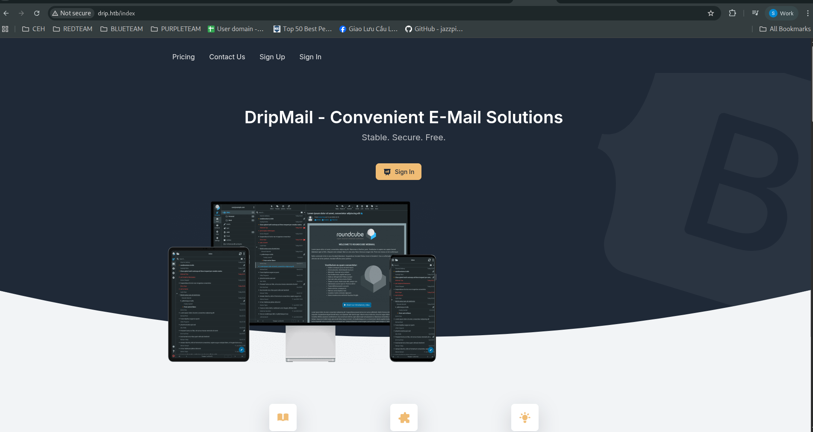</p>
Trang đăng kí
<p align="center"></p>
Trang đăng nhập redirect sang `mail.drip.htb`
<p align="center">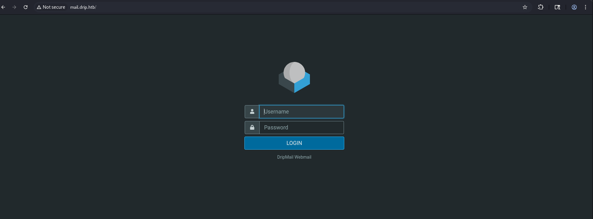</p>

### XSS CVE-2024-42009 <p align="center">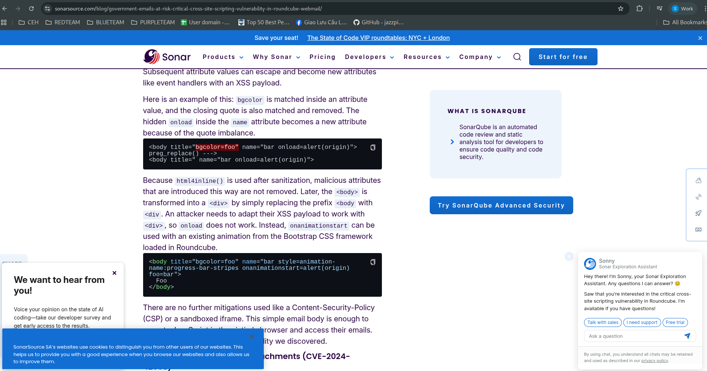</p>

XSS phần Contact
```
<body title="bgcolor=foo" name="bar style=animation-name:progress-bar-stripes onanimationstart=alert(origin) foo=bar">Foo</body>
```
<p align="center">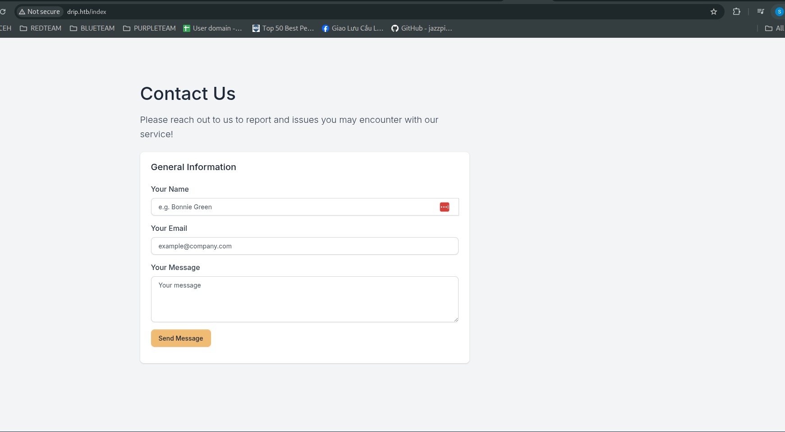</p>
Thành công
<p align="center">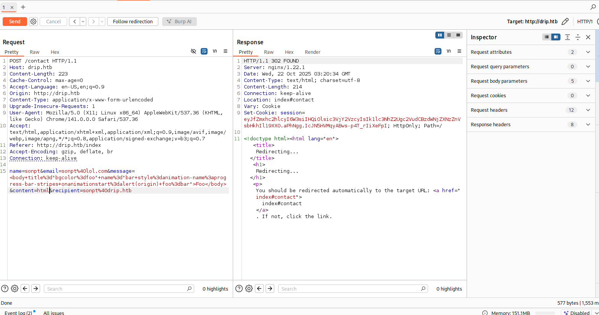</p>

### Tiêm mã độc XSS

 
[🔍 Encode base64 payload](./payload.js)
```
cat payload.js| base64 -w0
```
Chèn vào mã độc Burp
### XSS CVE-2024-42009 
<p align="center">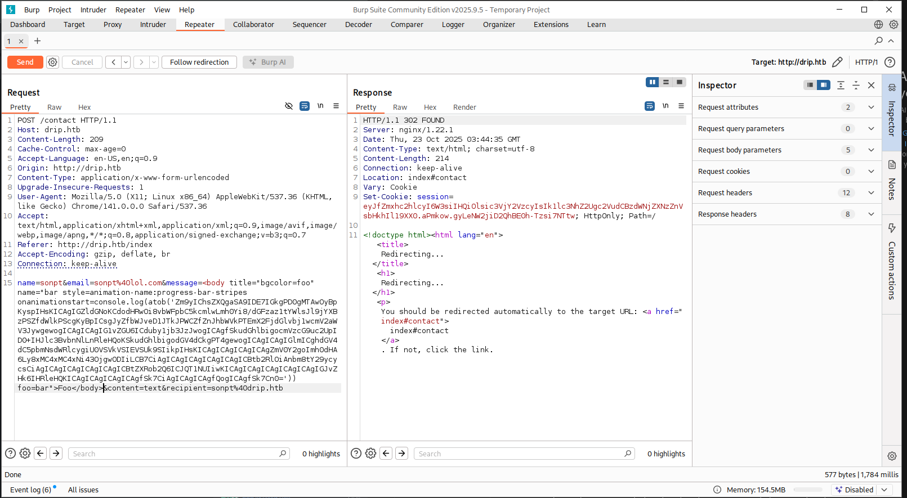</p>
Encode URL(sửa content html)

<p align="center">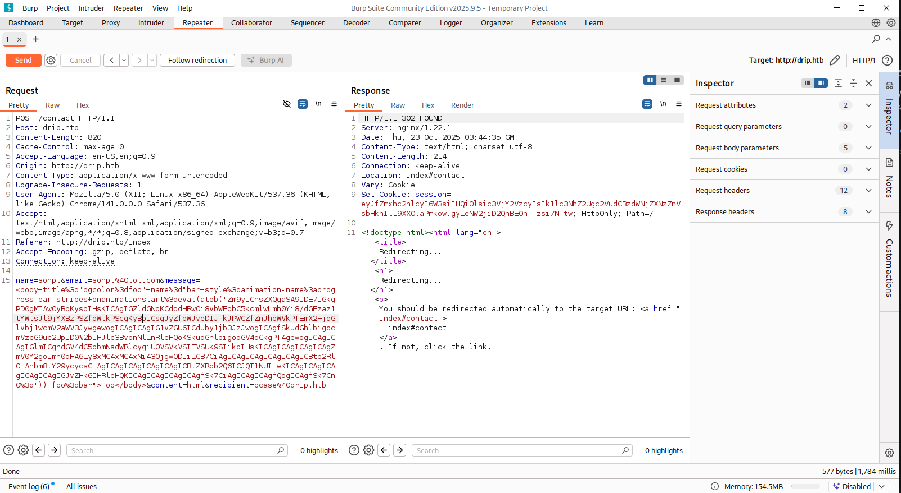</p>
tạo server hứng req user `bcase@drip.htb
[🔍 Server Python](./serve.py)
thấy có mail thông báo subdomain `dev-a3f1-01.drip.htb`
<p align="center">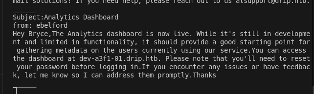</p>
Tạo payload gửi đến mail của `bcase`
<p align="center">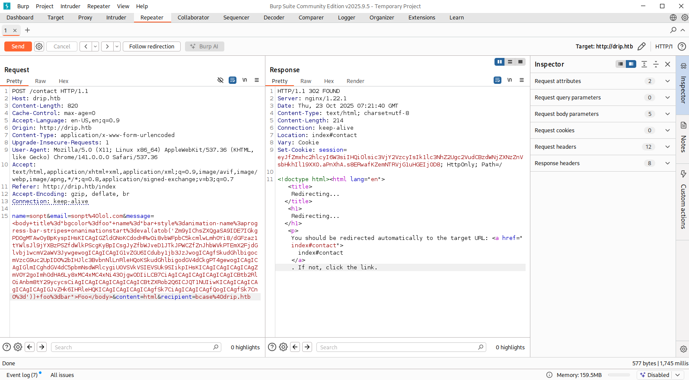</p>
Vào reset password
<p align="center">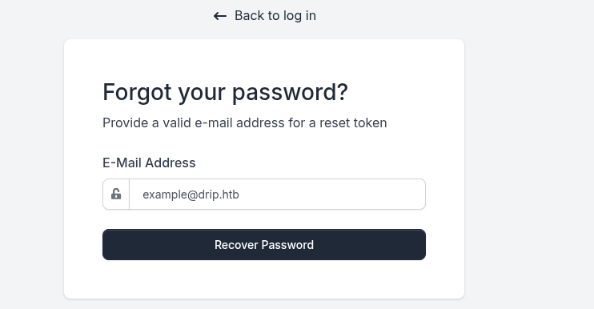</p>
lấy domain mail phản hồi và reset
<p align="center">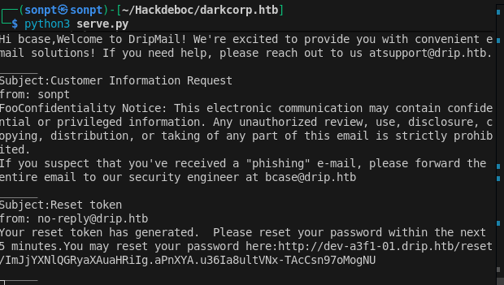</p>

### Đăng nhập vào trang dev user `bcase`

<p align="center">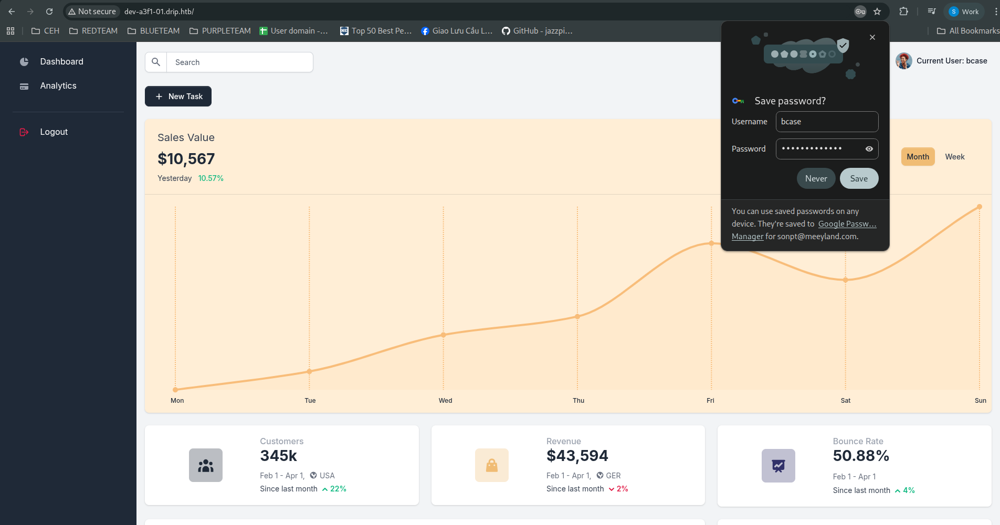</p>
[🔍 Payload sql](./inject.sql)